# <center>Matplotlib</center> 

#  一般概念

```python
%matplotlib inline
import matplotlib as mpl
# mpl.style.available
# mpl.style.use("dark_background")
# mpl.style.use("fivethirtyeight")
# mplstyle.use(['dark_background', 'ggplot', 'fast'])
mpl.style.use("seaborn-white") #before import pyplot or have no effect

import matplotlib.pyplot as plt
import numpy as np
```

```python
x = np.linspace(0, 2, 100)
fig = plt.figure() # 画布对象Figure ....<1>
fig.add_subplot() # 子图Axes对象    ....<2>
fig.suptitle('super title') 

plt.plot(x, x, label='linear') #可直接调用plt,默认创建一个figure,一个subplot,则<1><2>可省略
plt.plot(x, x**2, label='quadratic')
plt.plot(x, x**3, label='cubic')
plt.xlabel('x label')
plt.ylabel('y label')
plt.title("plt_title")
plt.legend()
plt.show()
```

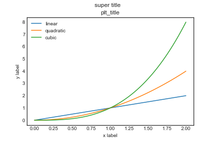

# pyplot 式绘图 

```python
from matplotlib.ticker import NullFormatter,FuncFormatter

# simulate data
x = np.linspace(0., 2., 100)

fig = plt.figure(figsize=(9,7),facecolor='None',edgecolor='None',dpi=80)  # A figure can have any number of Axes, but should have at least one.
fig.suptitle('super title')
plt.title("plt_title")

# fig.add_subplot(2,2,1) # add one of four subplots on figure
plt.subplot(2,2,1) # 注意有一个区别：fig.add_subplot()所绘子图的外围边框是相连的
plt.plot(x, x, label='linear')
plt.title('title of first Axes')
# plt.xlim(0.5,1.5)
# plt.ylim(1,3) 等价于
plt.axis([0.5,1.5,1,3])
plt.xlabel("Axes[0,0] x label")
plt.xticks(rotation=45,horizontalalignment='right')
plt.ylabel("Axes[0,0] y label")
plt.yscale('log') # "linear"、"log"、"symlog"、"logit"、
plt.legend()
plt.grid(True)
plt.gca().yaxis.set_minor_formatter(NullFormatter())
plt.plot([1.]*len(x),np.exp(x),'r--') #垂直线
plt.plot(x,[2.]*len(x),'r--') # 水平线

def xticklabels(x, pos):
	"""The two args are the value and tick position"""
	if x >= 1:
		s = '{:.1f}++'.format(x)
	else:
		s = '{:.1f}--'.format(x)
	return s
formatter = FuncFormatter(xticklabels)
plt.gca().xaxis.set_major_formatter(formatter)

# fig.add_subplot(2,2,2)
plt.subplot(2,2,2) 
plt.plot(x, x**2, label='quadratic')
plt.title("title of second Axes")
plt.legend()

# fig.add_subplot(2,2,3)
plt.subplot(2,2,3) 
plt.plot(x, x**3, label='cubic')
plt.title("title of third Axes")
plt.legend()

# fig.add_subplot(2,2,4)
plt.subplot(2,2,4) 
plt.plot(x, x**4, label='quartic')
plt.title("title of fourth Axes")
plt.legend()

#调整间距
plt.subplots_adjust(top=0.92, bottom=0.08, left=0.10, right=0.95, hspace=0.25,wspace=0.15)

plt.show()
```

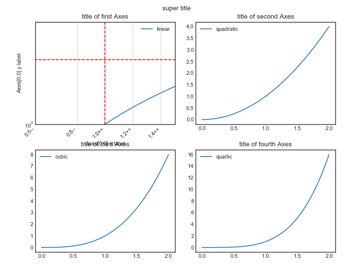

# OO（object-oriented）式绘图

```python 
from matplotlib.ticker import FuncFormatter
#写作一步
fig, axes = plt.subplots(2, 2,
                         figsize=(9,7), dpi=80, sharex=False, 
                         sharey=False,facecolor='None', edgecolor='None')  
# a figure with a 2x2 grid of Axes
# fig,(ax1,ax2,ax3,ax4) = plt.subplots(2,2) #axes[0,0]=ax1,axes[1,0]=ax3,...

fig.suptitle('super title') # Add a title so we know which it is
plt.title("plt_title") #不奏效，此时会添加到最后一个子图上

#子图Axes1
axes[0,0].plot(x, x, label='linear')
axes[0,0].set_title('title of first Axes')
axes[0,0].set_xlim(0.5,1.5)
axes[0,0].set_ylim(1,3)
axes[0,0].set_xlabel("Axes[0] x label")
axes[0,0].set_ylabel("Axes[0] y label")
axes[0,0].set_xticks([0.5,0.8,1.,1.2,1.4])
#labels = axes[0,0].get_xticklabels()
#plt.setp(labels, rotation=45, horizontalalignment='right')
axes[0,0].set_xticklabels(labels=['a','b','c','d','e'],
                          rotation=45, horizontalalignment='right')
axes[0,0].legend()
# 属性可一起设置
# axes[0,0].set(xlim=[0.5，1.5], xlabel="Axes[0] x label",
#				ylabel= "Axes[0] y label",title='title of first Axes',
#				xticks=[0.5,0.8,1.,1.2,1.4],xticklabels=['a','b','c','d','e'])
axes[0,0].axvline(1.,ls='--', color='r') #垂直线
axes[0,0].axhline(2.0,ls='--',color='r') #水平线


def xticklabels(x, pos):
	"""The two args are the value and tick position"""
	if x >= 1:
		s = '{:.1f}++'.format(x)
	else:
		s = '{:.1f}--'.format(x)
	return s
formatter = FuncFormatter(xticklabels)
axes[0,0].xaxis.set_major_formatter(formatter)

#子图Axes2
axes[0,1].plot(x, x**2, label='quadratic')
axes[0,1].set_title('title of second Axes')
axes[0,1].legend()

#子图Axes3
axes[1,0].plot(x, x**3, label='cubic')
axes[1,0].set_title('title of third Axes')
axes[1,0].legend()

#子图Axes4
axes[1,1].plot(x,x**4,label='quartic')
axes[1,1].set_title('title of fourth Axes')
axes[1,1].legend()

# 调整间距
plt.subplots_adjust(top=0.92,bottom=0.08,left=0.10,right=0.95,hspace=0.25,wspace=0.15)

plt.show()
```

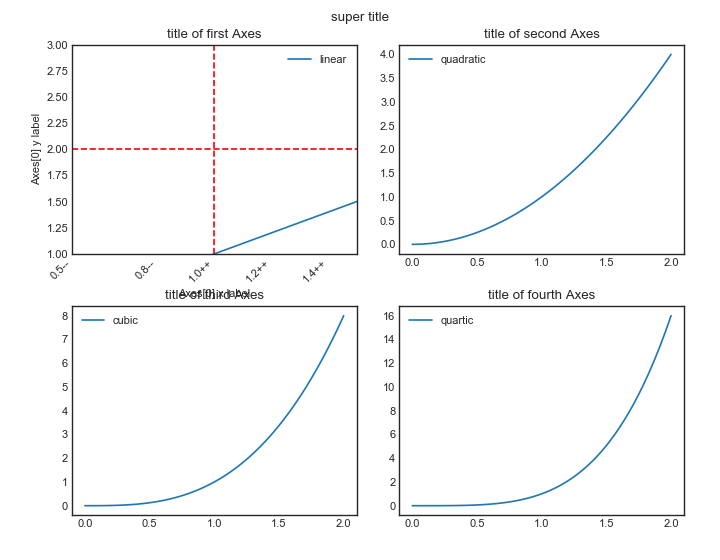

# pyplot

## line plot

```python
plt.plot(x1,y1,x2,y2,color='',label='',linestyle='',linewidth='',marker='',**kwargs)
#等价写法
lines = plt.plot(x1,y1,x2,y2）
plt.setp(lines,color='',label='',linestyle='',linewidth='',marker='',**kwargs)
# 可通过 plt.setp(lines)查看详细的绘图参数
```

`**kwargs` 包含以下内容：

| properties             | value                                      |
| ---------------------- | ------------------------------------------ |
| data                   | (np.array xdata, np.array ydata) 数据      |
| xdata                  | np.array                                   |
| ydata                  | np.array                                   |
| color or c             | str，颜色                                  |
| label                  | str，标签                                  |
| alpha                  | float，透明度                              |
| linestyle or ls        | '-'\|'--'\|'-.'\|'steps'\|...              |
| linewidth or lw        | float                                      |
| marker                 | '+'\|','\|'.'\|'1'\|'2'\|'3'\|'4'          |
| markeredgecolor or mec | any matplotlib color                       |
| markeredgewidth or mew | float value in points                      |
| markerfacecolor or mfc | any matplotlib color                       |
| markersize or ms       | float                                      |
| markevery              | None\|integer\|(startind,stride)           |
| animated               | True\|False                                |
| clip_box               | a matplotlib.transform.Bbox instance       |
| clip_on                | True\|False                                |
| clip_path              | a Path instance and a Transform instance   |
| antialiased or aa      | True\|False                                |
| contains               | the hit testing function                   |
| dash_capstyle          | 'butt'\|'round'\|'projecting'              |
| dash_joinstyle         | 'miter'\|'round'\|'bevel'                  |
| dashes                 | sequence of on/off ink in points           |
| lod                    | True\|False                                |
| figure                 | a matplotlib.figure.Figure instance        |
| picker                 | used in interactive line selection         |
| pickradius             | the line pick selection radius             |
| solid_capstyle         | 'butt'\|'round'\|'projecting'              |
| solid_joinstyle        | 'miter'\|'round'\|'bevel'                  |
| transform              | a matplotlib.transforms.Transform instance |
| visible                | True\|False                                |
| zorder                 | any number                                 |

```python
x = np.linspace(0., 2., 100)

fig = plt.figure()
fig.suptitle('super title')
plt.title("plt_title")
plt.plot(x,x,color='red',linestyle='-',marker='') #'r--'
plt.plot(x,x**1/2,'ko', x, x**2, 'bs', x, x**3, 'g^') 
''' 
'ko'、'r--'、'bs'、'g^'为颜色color与线型linestyle的合并简写：
	#'ko' black circle; 
	#'r--' red dash;
	#'bs' blue square;
	#'g^' green triangle
'''
plt.show()
```

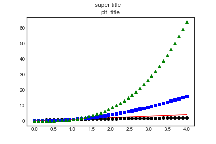

## scatter plot

```python
data = {'a': np.arange(50),
'c': np.random.randint(0, 50, 50),
'd': np.random.randn(50)}
data['b'] = data['a'] + 10 * np.random.randn(50)
data['d'] = np.abs(data['d']) * 100
plt.scatter('a', 'b', c='c', s='d', data=data)
plt.xlabel('entry a')
plt.ylabel('entry b')
plt.show()
```

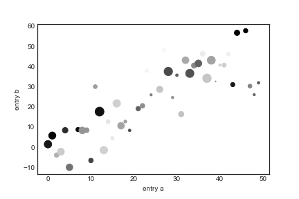

## bar charts

```python
names = ['a', 'b', 'c']
values = [10, 50, 100]
# bar
plt.bar(names, values)
plt.suptitle('Categorical Plotting')
plt.show()
```

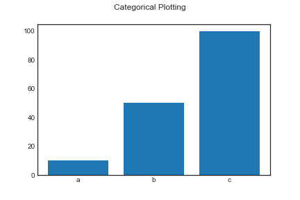

```python
# barh
plt.bar(names, values)
plt.suptitle('Categorical Plotting')
plt.show()
```

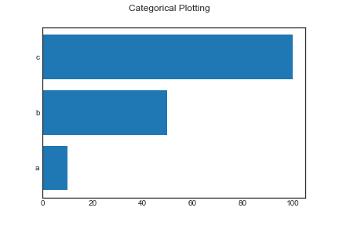

## histgrams

```python
# normal hist
fig1 = plt.figure(1)
mu, sigma = 100, 15
x = mu + sigma * np.random.randn(10000)

n, bins, patches = plt.hist(x, 50, density=1, facecolor='g', alpha=0.75)
plt.xlabel('Smarts',fontsize=14, color='red')
plt.ylabel('Probability')
plt.title('Histogram of IQ')
plt.text(60, .025, r'$\mu=100,\ \sigma=15$')
plt.axis([40, 160, 0, 0.03])
plt.grid(True)

# hist2d
fig2 = plt.figure(2)
y = np.random.randn(10000)

plt.hist2d(x,y)
plt.title("hist2d")
plt.show()
```

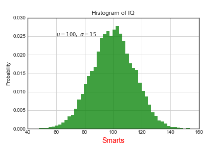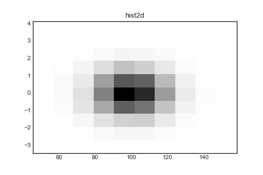

## pie charts

## tables

## log plots

## polar plots

## contouring and pseudocolor

## streamplot

## ellipses

## images

```python
import matplotlib.image as mpimg
img = mpimg.imread("image.jpg") 
# print(img) 
# img为np.ndarray 
# You can plot any numpy array
plt.imshow(img)
```


```python
# luminosity images
plt.figure(figsize=(10,8))
plt.subplot(121)
lum_img = img[:,:,0]
plt.imshow(lum_img,clim=(0,100), interpolation="nearest")
plt.colorbar()

plt.subplot(122)
plt.imshow(lum_img,cmap='hot', interpolation="bicubic") # cmap:'nipy_spectral'、'hot'
# imgplot = plt.imshow(lum_img)
# imgplot.set_cmap('hot')
plt.colorbar(ticks=[0, 25, 50, 75,100], orientation='horizontal')
```


#  Text and Annotate

```python
plt.text(x,y,s='str')
plt.annotate('str',xy=(,),xytext=(,),arrowprops=dict(facecolor,shrink))
```

## Text
* Basic text commands

| pyplot API | OO API     | description                                                  |
| ---------- | ---------- | ------------------------------------------------------------ |
| text       | text       | Add text at an arbitrary location of the Axes.               |
| annotate   | annotate   | Add an annotation, with an optional arrow, at an arbitrary location of the Axes. |
| xlabel     | set_xlabel | Add a label to the Axes’s x-axis.                            |
| ylabel     | set_ylabel | Add a label to the Axes’s y-axis.                            |
| title      | set_title  | Add a title to the Axes.                                     |
| figtext    | text       | Add text at an arbitrary location of the Figure.             |
| suptitle   | suptitle   | Add a title to the Figure.                                   |

```python
import matplotlib
import matplotlib.pyplot as plt
fig = plt.figure()
fig.suptitle('bold figure suptitle', fontsize=14, fontweight='bold')
ax = fig.add_subplot(111)
fig.subplots_adjust(top=0.85)
ax.set_title('axes title')
ax.set_xlabel('xlabel')
ax.set_ylabel('ylabel')
ax.text(3, 8, 'boxed italics text in data coords', style='italic',
        	bbox={'facecolor': 'red', 'alpha': 0.5, 'pad': 10})
ax.text(2, 6, r'an equation: E=mc^2', fontsize=15)
ax.text(3, 2, 'unicode: Institut für Festkörperphysik')
ax.text(0.95, 0.01, 'colored text in axes coords',
        verticalalignment='bottom', horizontalalignment='right',
        transform=ax.transAxes,color='green', fontsize=15)
ax.plot([2], [1], 'o')
ax.annotate('annotate', xy=(2, 1), xytext=(3, 4),
            arrowprops=dict(facecolor='black', shrink=0.05))
ax.axis([0, 10, 0, 10])
plt.show()
```

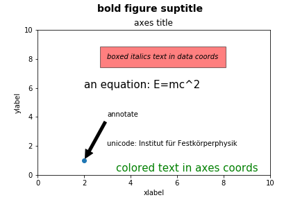

### label
#### labelpad and positon

```python
x1 = np.linspace(0.0, 5.0, 100)
y1 = np.cos(2 * np.pi * x1) * np.exp(-x1)

fig, ax = plt.subplots(figsize=(5, 3))
fig.subplots_adjust(bottom=0.15, left=0.2)
ax.plot(x1, y1)
ax.set_xlabel('time [s]', position=(0., 1e6),horizontalalignment='left')
ax.set_ylabel('Damped oscillation [V]',labelpad=40)
plt.show()
```

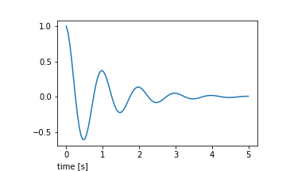

#### label font

```python
from matplotlib.font_manager import FontProperties
font = FontProperties()
font.set_family('serif')
font.set_name('Times New Roman')
font.set_style('italic')
fig, ax = plt.subplots(figsize=(5, 3))
fig.subplots_adjust(bottom=0.15, left=0.2)
ax.plot(x1, y1)
ax.set_xlabel('time [s]', fontsize='large', fontweight='bold')
ax.set_ylabel('Damped oscillation [V]', fontproperties=font)
plt.show()
```

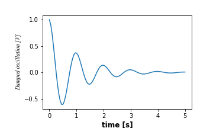

### title

```python
fig, axs = plt.subplots(3, 1, figsize=(5, 6), tight_layout=True)
locs = ['center', 'left', 'right']
pads = [0,20,50]
for ax, loc,pad in zip(axs, locs,pads):
    ax.plot(x1, y1)
    ax.set_title('Title with loc at '+loc+' and pad'+str(pad), loc=loc,pad=pad)
plt.show()
```

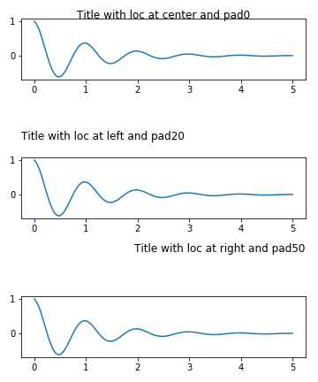

### Ticks and ticklabels
#### simple ticks and ticklabels

```python
fig, axs = plt.subplots(2, 1, figsize=(5, 3), tight_layout=True)
axs[0].plot(x1, y1)
axs[1].plot(x1, y1)
ticks = np.arange(0., 8.1, 2.)

# list comprehension to get all tick labels...
tickla = ['%1.2f' % tick for tick in ticks]
axs[1].xaxis.set_ticks(ticks)
axs[1].xaxis.set_ticklabels(tickla)
axs[1].set_xlim(axs[0].get_xlim())
plt.show()
```

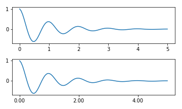

#### Tick Locators and Formatters

```python
fig, axs = plt.subplots(2, 2, figsize=(8, 5), tight_layout=True)
axs = axs.flatten()
for n, ax in enumerate(axs):
    ax.plot(x1*10., y1)
formatter = matplotlib.ticker.FormatStrFormatter('%1.1f')
locator = matplotlib.ticker.MaxNLocator(nbins='auto', steps=[1, 4, 10])
axs[1].xaxis.set_major_locator(locator)
axs[1].xaxis.set_major_formatter(formatter)
formatter = matplotlib.ticker.FormatStrFormatter('%1.5f')
locator = matplotlib.ticker.AutoLocator()
axs[2].xaxis.set_major_formatter(formatter)
axs[2].xaxis.set_major_locator(locator)
formatter = matplotlib.ticker.FormatStrFormatter('%1.5f')
locator = matplotlib.ticker.MaxNLocator(nbins=4)
axs[3].xaxis.set_major_formatter(formatter)
axs[3].xaxis.set_major_locator(locator)
plt.show()

# FuncFormatter
def formatoddticks(x, pos):
	"""Format odd tick positions
	"""
    if x % 2:
        return '%1.2f' % x
    else:
        return ''
fig, ax = plt.subplots(figsize=(5, 3), tight_layout=True)
ax.plot(x1, y1)
formatter = matplotlib.ticker.FuncFormatter(formatoddticks)
locator = matplotlib.ticker.MaxNLocator(nbins=6)
ax.xaxis.set_major_formatter(formatter)
ax.xaxis.set_major_locator(locator)
plt.show()
```

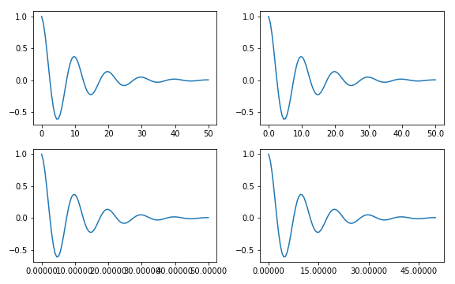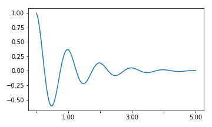

## Annotate

```python
ax = plt.subplot(111)
t = np.arange(0.0, 5.0, 0.01)
s = np.cos(2*np.pi*t)
line, = plt.plot(t, s, lw=2)
plt.annotate('local max', xy=(2, 1), xytext=(3, 1.5),
             arrowprops=dict(facecolor='black', shrink=0.05)
            )
plt.ylim(-2, 2)
plt.show()
```

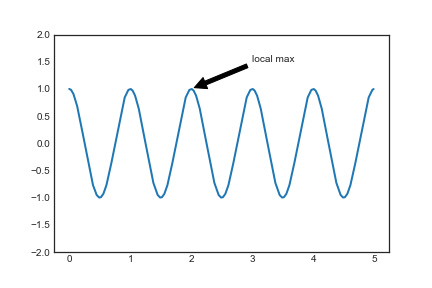

# Legend

```python
plt.legend(handle=[],labels=[],bbox_to_anchor=(),loc='', borderaxespad=0.)
```

## legend entry

```python
import matplotlib.pyplot as plt
import matplotlib.patches as mpatches
import matplotlib.lines as mlines

red_patch = mpatches.Patch(color='red', label='The red data')
blue_line = mlines.Line2D([], [], color='blue', marker='*',
                          markersize=15, label='Blue stars')

plt.legend(handles=[red_patch,blue_line])
plt.show()
```

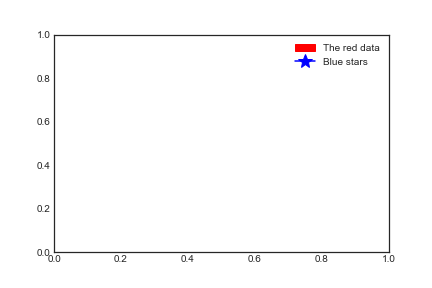

## legend location

```python
plt.subplot(211)
plt.plot([1, 2, 3], label="test1")
plt.plot([3, 2, 1], label="test2")
# Place a legend above this subplot, expanding itself to
# fully use the given bounding box.
plt.legend(bbox_to_anchor=(0., 1.02, 1., .102), 
           loc='lower left',ncol=2, mode="expand", borderaxespad=0.)

plt.subplot(223)
plt.plot([1, 2, 3], label="test1")
plt.plot([3, 2, 1], label="test2")
# Place a legend to the right of this smaller subplot.
plt.legend(bbox_to_anchor=(1.05, 1), 
           loc='upper left', borderaxespad=0.)

plt.show()
```

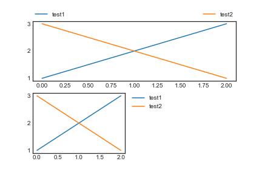

```python
# multiple legends
line1, = plt.plot([1, 2, 3], label="Line 1", linestyle='--')
line2, = plt.plot([3, 2, 1], label="Line 2", linewidth=4)

# Create a legend for the first line.
first_legend = plt.legend(handles=[line1], loc='upper right')
# Add the legend manually to the current Axes.
ax = plt.gca().add_artist(first_legend)

# Create another legend for the second line.
plt.legend(handles=[line2], loc='lower right')
plt.show()
```

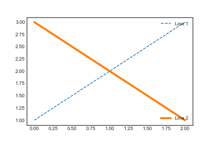

## legend Handlers

```python
from matplotlib.legend_handler import HandlerLine2D,HandlerTuple
fig = plt.figure()
# 改变其中一个
plt.subplot(131)
line1, = plt.plot([3, 2, 1], marker='o', label='Line 1')
line2, = plt.plot([1, 2, 3], marker='o', label='Line 2')
plt.legend(handler_map={line1: HandlerLine2D(numpoints=4)})

# 拼合其中一个
plt.subplot(132)
z = np.random.randn(10)
red_dot, = plt.plot(z, "ro", markersize=15)
# Put a white cross over some of the data.
white_cross, = plt.plot(z[:5], "w+", markeredgewidth=3, markersize=15)
plt.legend([red_dot, (red_dot, white_cross)], ["Attr A", "Attr A+B"])

# 二合一
plt.subplot(133)
p1, = plt.plot([1, 2.5, 3], 'r-d')
p2, = plt.plot([3, 2, 1], 'k-o')
plt.legend([(p1, p2)], ['Two keys'], numpoints=1,
               handler_map={tuple: HandlerTuple(ndivide=None)})
plt.show()
```

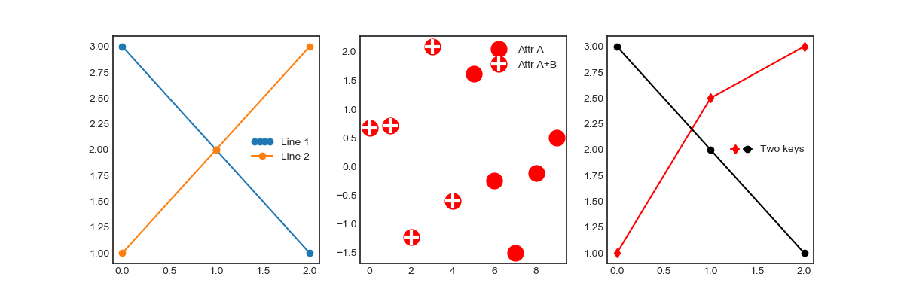

```python
# custom legend handler
import matplotlib.patches as mpatches
class AnyObject(object):
    pass
class AnyObjectHandler(object):
    def legend_artist(self, legend, orig_handle, fontsize, handlebox):
        x0, y0 = handlebox.xdescent, handlebox.ydescent
        width, height = handlebox.width, handlebox.height
        patch = mpatches.Rectangle([x0, y0], width, height,facecolor='red',edgecolor='black', 
                                   hatch='xx', lw=3,transform=handlebox.get_transform())
        handlebox.add_artist(patch)
        return patch
plt.legend([AnyObject()], ['My first handler'],
           handler_map={AnyObject: AnyObjectHandler()})
```

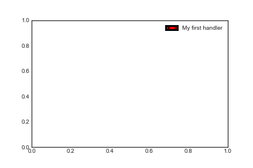

```python
from matplotlib.legend_handler import HandlerPatch
class HandlerEllipse(HandlerPatch):
    def create_artists(self, legend, orig_handle,xdescent, 
                       ydescent, width, height, fontsize, trans):
        center = 0.5 * width - 0.5 * xdescent, 0.5 * height - 0.5 * ydescent
        p = mpatches.Ellipse(xy=center, width=width + xdescent,height=height + ydescent)
        self.update_prop(p, orig_handle, legend)
        p.set_transform(trans)
        return [p]

c = mpatches.Circle((0.5, 0.5), 0.25, facecolor="green",edgecolor="red", linewidth=3)
plt.gca().add_patch(c)
plt.legend([c], ["An ellipse, not a rectangle"],
           handler_map={mpatches.Circle: HandlerEllipse()})
```

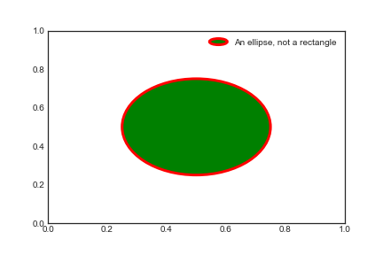

# Path
## Path patch
* all of the matplotlib.patch objects is the Path, which supports the standard set of `moveto, lineto, curveto` commands to draw simple and compound outlines consisting of line segments and splines.

  | Code      | Vertices                       | Description                                                  |
  | --------- | ------------------------------ | ------------------------------------------------------------ |
  | STOP      | 1(ignored)                     | A marker for the end of the entire path (currently not required and ignored) |
  | MOVETO    | 1                              | Pick up the pen and move to the given vertex.                |
  | LINETO    | 1                              | Draw a line from the current position to the given vertex.   |
  | CURVE3    | 2(1 control point,1 endpoint)  | Draw a quadratic Bézier curve from the current position, with the given control point, to the given end point |
  | CURVE4    | 3(2 controlpoints, 1 endpoint) | Draw a cubic Bézier curve from the current position, with the given control points, to the given end point. |
  | CLOSEPOLY | 1(point itself is ignored)     | Draw a line segment to the start point of the current polyline. |

  ```python
  import matplotlib.pyplot as plt
  from matplotlib.path import Path
  import matplotlib.patches as patches
  
  # Path vertices
  verts = [
  	(0., 0.), # left, bottom
  	(0., 1.), # left, top
  	(1., 1.), # right, top
  	(1., 0.), # right, bottom
  	(0., 0.), # ignored
  ]
  
  # Path codes
  codes = [
      Path.MOVETO,
      Path.LINETO,
      Path.LINETO,
      Path.LINETO,
      Path.CLOSEPOLY,
  ]
  
  path = Path(verts, codes)
  fig, ax = plt.subplots()
  patch = patches.PathPatch(path, facecolor='orange', lw=2)
  ax.add_patch(patch)
  ax.set_xlim(-2, 2)
  ax.set_ylim(-2, 2)
  plt.show()
  ```

  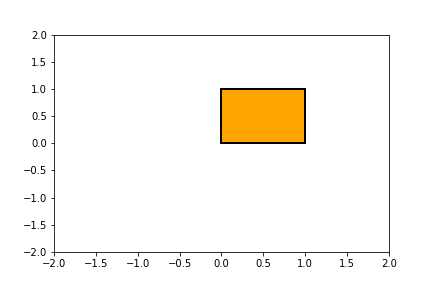

* Bézier example

  ```python
  verts = [
      (0., 0.), # P0
      (0.2, 1.), # P1
      (1., 0.8), # P2
      (0.8, 0.), # P3
  ]
  codes = [
      Path.MOVETO,
      Path.CURVE4,
      Path.CURVE4,
      Path.CURVE4,
  ]
  path = Path(verts, codes)
  fig, ax = plt.subplots()
  patch = patches.PathPatch(path, facecolor='none', lw=2)
  ax.add_patch(patch)
  xs, ys = zip(*verts)
  ax.plot(xs, ys, 'x--', lw=2, color='black', ms=10)
  ax.text(-0.05, -0.05, 'P0')
  ax.text(0.15, 1.05, 'P1')
  ax.text(1.05, 0.85, 'P2')
  ax.text(0.85, -0.05, 'P3')
  ax.set_xlim(-0.1, 1.1)
  ax.set_ylim(-0.1, 1.1)
  plt.show()
  ```

  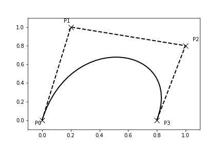

## Path effects
* Artists have a path effect applied to them include `Patch, Line2D, Collection and even Text`. 
* Each artist’s path effects can be controlled via the `set_path_effects` method.
### Normal effect
* Normal effect draws the artist without any effect.

  ```python
  import matplotlib.pyplot as plt
  import matplotlib.patheffects as path_effects
  fig = plt.figure(figsize=(5, 1.5))
  text = fig.text(0.5, 0.5, 'Hello path effects world!\nThis is the normal '
                  'path effect.\nPretty dull, huh?',ha='center', va='center', size=20)
  text.set_path_effects([path_effects.Normal()])
  plt.show()
  ```

  

### shadow effect
* SimplePatchShadow and SimpleLineShadow

  ```python
  import matplotlib.patheffects as path_effects
  text = plt.text(0.5, 0.5, 'Hello path effects world!',
                  path_effects=[path_effects.withSimplePatchShadow()])
  plt.plot([0, 3, 2, 5], linewidth=5, color='blue',
                   path_effects=[path_effects.SimpleLineShadow(),
                                  path_effects.Normal()])
  plt.show()
  ```

  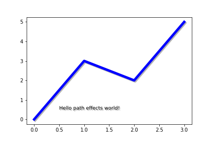

### stroke effect
* this effect only works because we have drawn the text path twice;once with a thick black line, and then once with the original text path on top.

  ```python
  fig = plt.figure(figsize=(7, 1))
  text = fig.text(0.5, 0.5, 'This text stands out because of\n''its black border.',
                  color='white',ha='center', va='center', size=30)
  text.set_path_effects([path_effects.Stroke(linewidth=3, foreground='black'),path_effects.Normal()])
  plt.show()
  ```

  

### PathPatchEffect
* Greater control of the path effect artist

  ```python
  fig = plt.figure(figsize=(8, 1))
  text = fig.text(0.02, 0.5, 'Hatch shadow', fontsize=75, weight=1000, va='center')
  text.set_path_effects([
      path_effects.PathPatchEffect(offset=(4, -4), hatch='xxxx',facecolor='gray'),
      path_effects.PathPatchEffect(edgecolor='white', linewidth=1.1,facecolor='black')
      ])
  plt.show()
  ```

  

# Colorbars

## colorbars location

```python
import matplotlib.colors as mcolors
arr = np.arange(100).reshape((10, 10))
norm = mcolors.Normalize(vmin=0., vmax=100.)
# see note above: this makes all pcolormesh calls consistent:
pc_kwargs = {'rasterized': True, 'cmap': 'viridis', 'norm': norm}
fig, axs = plt.subplots(3, 3, figsize=(4, 4), constrained_layout=True)
for ax in axs.flatten():
	im = ax.pcolormesh(arr, **pc_kwargs)
fig.colorbar(im, ax=axs[1:, ][:, 1], shrink=0.8)
fig.colorbar(im, ax=axs[:, -1], shrink=0.6)
```

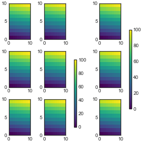

```python
fig, axs = plt.subplots(3, 1, figsize=(4, 4), constrained_layout=True)
for ax in axs[:2]:
	im = ax.pcolormesh(arr, **pc_kwargs)
fig.colorbar(im, ax=axs[:2], shrink=0.6)
im = axs[2].pcolormesh(arr, **pc_kwargs)
fig.colorbar(im, ax=axs[2], shrink=0.6) #

fig, axs = plt.subplots(3, 1, figsize=(4, 4), constrained_layout=True)
for ax in axs[:2]:
	im = ax.pcolormesh(arr, **pc_kwargs)
fig.colorbar(im, ax=axs[:2], shrink=0.6)
im = axs[2].pcolormesh(arr, **pc_kwargs)
fig.colorbar(im, ax=[axs[2]], shrink=0.6) #The API to make a single-axes behave like a list of axes is to specify it as a list (or other iterable container)
```

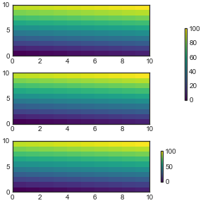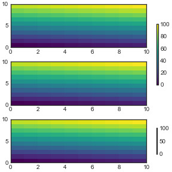

## Customized Colorbars
### Basic continuous colorbar
* create the colorbar by calling ColorbarBase and specify axis, colormap, norm and orientation
  as parameters.

  ```python
  import matplotlib.pyplot as plt
  import matplotlib as mpl
  fig, ax = plt.subplots(figsize=(6, 1))
  fig.subplots_adjust(bottom=0.5)
  cmap = mpl.cm.cool
  norm = mpl.colors.Normalize(vmin=5, vmax=10)
  cb1 = mpl.colorbar.ColorbarBase(ax, cmap=cmap,
                                  norm=norm,orientation='horizontal')
  cb1.set_label('Some Units')
  fig.show()
  ```

  

### Discrete intervals colorbar

```python
fig, ax = plt.subplots(figsize=(6, 1))
fig.subplots_adjust(bottom=0.5)
cmap = mpl.colors.ListedColormap(['red', 'green', 'blue', 'cyan'])
cmap.set_over('0.25') # Over and under are used to display data outside of the normalized [0,1] range.
cmap.set_under('0.75')
bounds = [1, 2, 4, 7, 8]
norm = mpl.colors.BoundaryNorm(bounds, cmap.N) #generates a colormap index based on discrete intervals and extended ends to show the "over" and "under" value colors.
cb2 = mpl.colorbar.ColorbarBase(ax, cmap=cmap,
                                norm=norm,
                                boundaries=[0] + bounds + [13],
                                extend='both',
                                ticks=bounds,
                                spacing='proportional',
                                orientation='horizontal')
cb2.set_label('Discrete intervals, some other units')
fig.show()
```

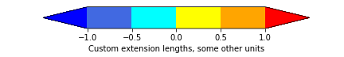

### Colorbar with custom extension lengths
* To make the length of each extension the same as the length of the interior colors, use extendfrac='auto'.

  ```python
  fig, ax = plt.subplots(figsize=(6, 1))
  fig.subplots_adjust(bottom=0.5)
  cmap = mpl.colors.ListedColormap(['royalblue', 'cyan',
                                    'yellow', 'orange'])
  cmap.set_over('red')
  cmap.set_under('blue')
  bounds = [-1.0, -0.5, 0.0, 0.5, 1.0]
  norm = mpl.colors.BoundaryNorm(bounds, cmap.N)
  cb3 = mpl.colorbar.ColorbarBase(ax, cmap=cmap,norm=norm,
                                  boundaries=[-10] + bounds + [10],
                                  extend='both',
                                  extendfrac='auto',
                                  ticks=bounds,
                                  spacing='uniform',
                                  orientation='horizontal')
  cb3.set_label('Custom extension lengths, some other units')
  fig.show()
  ```

  

# Transformation Framework

* transformation framework to easily move between coordinate systems, the userland `data coordinate system`, the `axes coordinate system`, the `figure coordinate system`, and the `display coordinate system`.
* Transformation Object

| Coordinates     | Transformation object                                 | Description                                                  |
| --------------- | ----------------------------------------------------- | ------------------------------------------------------------ |
| "data"          | ax.transData                                          | The coordinate system for the data, controlled by xlim and ylim. |
| "axes"          | ax.transAxes                                          | The coordinate system of the Axes; (0, 0) is bottom left of the axes, and (1, 1) is top right of the axes. |
| "figure"        | fig.transFigure                                       | The coordinate system of the Figure; (0, 0) is bottom left of the figure, and (1, 1) is top right of the figure. |
| "figureinches"  | fig.dpi_scale_trans                                   | The coordinate system of the Figure in inches; (0, 0) is bottom left of the figure, and (width, height) is the top right of the figure in inches. |
| "display"       | None, or IdentityTransform()                          | The pixel coordinate system of the display window; (0, 0) is bottom left of the window, and (width, height) is top right of the display window in pixels. |
| "xaxis","yaxis" | ax.get_xaxis_transform(),<br>ax.get_yaxis_transform() | Blended coordinate systems; use data coordinates on one of the axis and axes coordinates on the other. |

## Data coordinates

```python
x = np.arange(0, 10, 0.005)
y = np.exp(-x/2.) * np.sin(2np.pix)
fig, ax = plt.subplots()
ax.plot(x, y)
ax.set_xlim(0, 10)
ax.set_ylim(-1, 1)
xdata, ydata = 5, 0
xdisplay, ydisplay = ax.transData.transform_point((xdata, ydata))
bbox = dict(boxstyle="round", fc="0.8")
arrowprops = dict(
arrowstyle="->",
connectionstyle="angle,angleA=0,angleB=90,rad=10")
offset = 72
ax.annotate('data = (%.1f, %.1f)' % (xdata, ydata),
(xdata, ydata), xytext=(-2offset, offset), textcoords='offset points',
bbox=bbox, arrowprops=arrowprops)
disp = ax.annotate('display = (%.1f, %.1f)' % (xdisplay, ydisplay),
(xdisplay, ydisplay), xytext=(0.5offset, -offset),
xycoords='figure pixels',
textcoords='offset points',
bbox=bbox, arrowprops=arrowprops)
plt.show()
```

## Axes coordinates
* the point (0, 0) is the bottom left of your axes or subplot, (0.5, 0.5) is the center, 
  and (1.0, 1.0) is the top right.
* This coordinate system is extremely useful when placing text in your axes.

```python
fig = plt.figure()
for i, label in enumerate(('A', 'B', 'C', 'D')):
    ax = fig.add_subplot(2, 2, i+1)
    ax.text(0.05, 0.95, label, transform=ax.transAxes,
            fontsize=16, fontweight='bold', va='top')
plt.tight_layout()
plt.show()
```

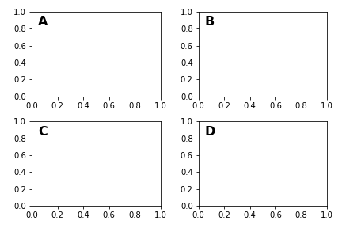

* Use the pan/zoom tool to move around, or manually change the data xlim and ylim, and you will see the data move, but the circle will remain fixed because it is not in data coordinates and will always remain at the center of the axes.

  ```python
  import matplotlib.patches as mpatches
  fig, ax = plt.subplots()
  x, y = 10*np.random.rand(2, 1000)
  ax.plot(x, y, 'go', alpha=0.2) # plot some data in data coordinates
  circ = mpatches.Circle((0.5, 0.5), 0.25, transform=ax.transAxes,
                         facecolor='blue', alpha=0.75)
  ax.add_patch(circ)
  plt.show()
  ```

  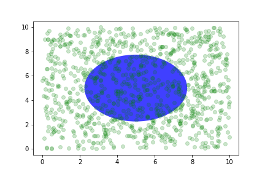

* Plotting in physical units:
>If done interactively, you can see that changing the size of the figure does not change the offset of the circle from the lower-left corner, does not change its size, and the circle remains a circle regardless of the aspect ratio of the axes.
```python
fig, ax = plt.subplots(figsize=(5, 4))
x, y = 10*np.random.rand(2, 1000)
ax.plot(x, y*10., 'go', alpha=0.2) # plot some data in data coordinates

# add a circle in fixed-units
circ = mpatches.Circle((2.5, 2), 1.0, transform=fig.dpi_scale_trans,facecolor='blue', alpha=0.75)
ax.add_patch(circ)
plt.show()
```

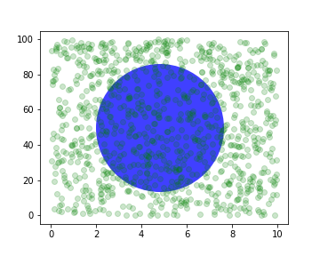

## blended transformations

* Drawing in blended coordinate spaces which mix axes with data coordinates is extremely useful.

* easy to plot(see `axhline(), axvline(), axhspan(), axvspan()`)

  ```python
  import matplotlib.transforms as transforms
  fig, ax = plt.subplots()
  x = np.random.randn(1000)
  ax.hist(x, 30)
  ax.set_title(r'$\sigma=1 \/ \dots \/ \sigma=2$', fontsize=16)
  # the x coords of this transformation are data, and the
  # y coord are axes
  trans = transforms.blended_transform_factory(ax.transData, ax.transAxes)
  # highlight the 1..2 stddev region with a span.
  # We want x to be in data coordinates and y to
  # span from 0..1 in axes coords
  rect = mpatches.Rectangle((1, 0), width=1, height=1,
                            transform=trans, color='yellow',alpha=0.5)
  ax.add_patch(rect)
  plt.show()
  ```

  

# GUI widgets

# Filled curves

# Date handling

# mplot3D

# 自定义对象（customizing objects）

## 对象属性（properties）

Artist instances are stored as member variables `Figure.patch`and `Axes.patch` (”Patch” is a name inherited from MATLAB, and is a 2D ”patch” of color on the figure, e.g., rectangles, circles and polygons). Every matplotlib Artist has many [properties][](pyplot=>line plot)

```python
[In] matplotlib.artist.getp(fig.patch)
[Out]	
	alpha = 1.0
	animated = False
	antialiased or aa = True
	axes = None
	clip_box = None
	clip_on = False
	clip_path = None
	contains = None
	edgecolor or ec = w
	facecolor or fc = 0.75
	figure = Figure(8.125x6.125)
	fill = 1
	hatch = None
	height = 1
	label =
	linewidth or lw = 1.0
	picker = None
	transform = <Affine object at 0x134cca84>
	verts = ((0, 0), (0, 1), (1, 1), (1, 0))
	visible = True
	width = 1
	window_extent = <Bbox object at 0x134acbcc>
	x = 0
	y = 0
	zorder = 1
```

## 对象容器（object container）

### Figure container

* `matplotlib.figure.Figure`是顶层容器，包含一切对象。

* 其背景是一个`Rectangle`，存储在`Figure.patch`中。

* `fig.add_subplot()`以及`fig.add_axes()`均被添加进了`Figure.axes`中。

  ```python
  for ax in fig.axes: #可以给每一个子图添加网格线
  	ax.grid(True)
  ```

* `Figure`有其自己的 `text, lines, patches and images`, 可以直接添加这些对象。

  ```python
  import matplotlib.lines as lines
  fig = plt.figure()
  l1 = lines.Line2D([0, 1], [0, 1], transform=fig.transFigure, figure=fig)
  l2 = lines.Line2D([0, 1], [1, 0], transform=fig.transFigure, figure=fig)
  fig.lines.extend([l1, l2])
  plt.show()
  ```

  

* `Figure`的属性

  | Figure attribute | Description                                                  |
  | ---------------- | ------------------------------------------------------------ |
  | axes             | A list of Axes instances (includes Subplot)                  |
  | patch            | The Rectangle background                                     |
  | images           | A list of Figure Images patches - useful for raw pixel display |
  | legends          | A list of Figure Legend instances (different from Axes.legends) |
  | lines            | A list of Figure Line2D instances (rarely used, see Axes.lines) |
  | patches          | A list of Figure patches (rarely used, see Axes.patches)     |
  | texts            | A list Figure Text instances                                 |

### Axes container

* `matplotlib.axes.Axes`是matploblib的核心。

* 包含一个`Rectangle patch` 用于笛卡尔坐标系以及一个`Circle patch`用于极坐标系。

  ```python
  ax = fig.add_subplot(111)
  rect = ax.patch # a Rectangle instance
  rect.set_facecolor('green')
  
  ax.plot() # 创建了个 matplotlib.lines.Line2D() 实例，并加入了Axes.lines container
  ```

* `Axes`的属性

  | Axes attribute | Description                            |
  | -------------- | -------------------------------------- |
  | artists        | A list of Artist instances             |
  | patch          | Rectangle instance for Axes background |
  | collections    | A list of Collection instances         |
  | images         | A list of AxesImage                    |
  | legends        | A list of Legend instances             |
  | lines          | A list of Line2D instances             |
  | patches        | A list of Patch instances              |
  | texts          | A list of Text instances               |
  | xaxis          | matplotlib.axis.XAxis instance         |
  | yaxis          | matplotlib.axis.YAxis instance         |

### Axis containers

* `matplotlib.axis.Axis` 处理`the tick lines, the grid lines, the tick labels and the axis label`.

  ```python
  fig, ax = plt.subplots()
  ax.xaxis.set_major_formatter()
  ax.xaxis.get_major_locator()
  ax.xaxis.get_major_formatter()
  ax.xaxis.get_minor_locator()
  ax.xaxis.get_minor_formatter()
  ax.xaxis.get_major_ticks()
  ax.xaxis.get_minor_ticks()
  
  ax.xaxis.get_ticklocs()
  ax.xaxis.get_ticklabels()
  ax.xaxis.get_ticklines() #major ticks
  ax.xaxis.get_ticklines(minor=True)
  
  ax.xaxis.get_scale()
  ax.xaxis.get_label()
  ax.xaxis.get_view_interval()
  ax.xaxis.get_data_interval()
  
  ax.xaxis.get_gridlines()
  ax.xaxis.grid()
  ```

* <b>example:</b>

  ```python
  fig = plt.figure()
  rect = fig.patch # a rectangle instance
  rect.set_facecolor('lightgoldenrodyellow')
  ax1 = fig.add_axes([0.1, 0.3, 0.4, 0.4])
  rect = ax1.patch
  rect.set_facecolor('lightslategray')
  for label in ax1.xaxis.get_ticklabels():
  # label is a Text instance
  label.set_color('red')
  label.set_rotation(45)
  label.set_fontsize(16)
  for line in ax1.yaxis.get_ticklines():
  # line is a Line2D instance
  line.set_color('green')
  line.set_markersize(25)
  line.set_markeredgewidth(3)
  plt.show()
  ```

  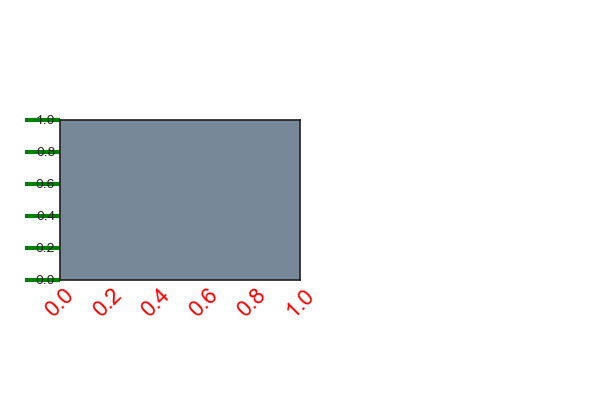

### Tick containers

* `matplotlib.axis.Tick` 包含 `tick` 、`grid line`和`label`实例。

* `Tick`的属性

  | Tick attribute | Description                                                 |
  | -------------- | ----------------------------------------------------------- |
  | tick1line      | Line2D instance                                             |
  | tick2line      | Line2D instance                                             |
  | gridline       | Line2D instance                                             |
  | label1         | Text instance                                               |
  | label2         | Text instance                                               |
  | gridOn         | boolean which determines whether to draw the gridline       |
  | tick1On        | boolean which determines whether to draw the 1st tickline   |
  | tick2On        | boolean which determines whether to draw the 2nd tickline   |
  | label1On       | boolean which determines whether to draw the 1st tick label |
  | label2On       | boolean which determines whether to draw the 2nd tick label |

* <b>example:</b>

  ```python
  import matplotlib.ticker as ticker
  # Fixing random state for reproducibility
  np.random.seed(19680801)
  fig, ax = plt.subplots()
  ax.plot(100*np.random.rand(20))
  formatter = ticker.FormatStrFormatter('$%1.2f')
  ax.yaxis.set_major_formatter(formatter)
  for tick in ax.yaxis.get_major_ticks():
  tick.label1On = False
  tick.label2On = True
  tick.label2.set_color('green')
  plt.show()
  ```

  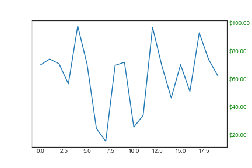

# 自定义图形层叠(Customizing Figure Layouts)

## fig.add_subplot(spec[,])

```python
fig, axes = plt.subplots(ncols=2, nrows=2, constrained_layout=True)
```

等价于：

```python
import matplotlib.gridspec as gridspec
fig = plt.figure(constrained_layout=True)
spec = gridspec.GridSpec(ncols=2, nrows=2, figure=fig)
ax1 = fig.add_subplot(spec[0, 0])
ax2 = fig.add_subplot(spec[0, 1])
ax3 = fig.add_subplot(spec[1, 0])
ax4 = fig.add_subplot(spec[1, 1])
```

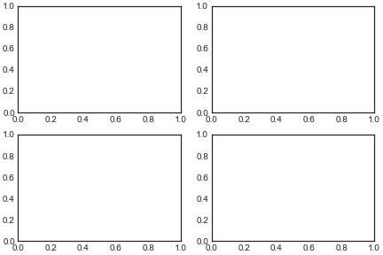

```python
fig = plt.figure(constrained_layout=True)
gs = fig.add_gridspec(3, 3)
ax1 = fig.add_subplot(gs[0, :])
ax1.set_title('gs[0, :]')
ax2 = fig.add_subplot(gs[1, :-1])
ax2.set_title('gs[1, :-1]')
ax3 = fig.add_subplot(gs[1:, -1])
ax3.set_title('gs[1:, -1]')
ax4 = fig.add_subplot(gs[-1, 0])
ax4.set_title('gs[-1, 0]')
ax5 = fig.add_subplot(gs[-1, -2])
ax5.set_title('gs[-1, -2]')
```

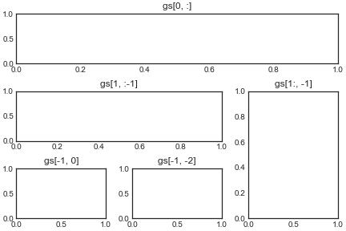

## fig.add_gridspec()

```python
fig = plt.figure(constrained_layout=True)
widths = [2, 3, 1.5]
heights = [1, 3, 2]
spec5 = fig.add_gridspec(ncols=3, nrows=3, width_ratios=widths,height_ratios=heights)
for row in range(3):
    for col in range(3):
        ax = fig.add_subplot(spec5[row, col])
        label = 'Width: {}\nHeight: {}'.format(widths[col], heights[row])
        ax.annotate(label, (0.1, 0.5), xycoords='axes fraction', va='center')
```


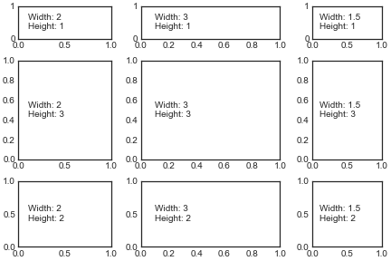

## axes.get_gridspec()

```python
fig, axs = plt.subplots(ncols=3, nrows=3)
gs = axs[1, 2].get_gridspec()
# remove the underlying axes
for ax in axs[1:, -1]:
    ax.remove()
    axbig = fig.add_subplot(gs[1:, -1])
    axbig.annotate('Big Axes \nGridSpec[1:, -1]', (0.1, 0.5),
    xycoords='axes fraction', va='center')

fig.tight_layout()
```

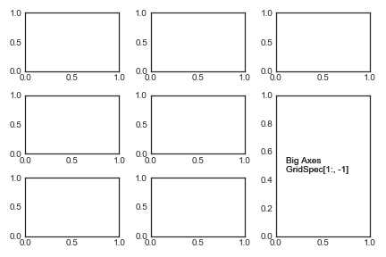

## fig.add_gridspec().subgridspec()

```python
fig = plt.figure(constrained_layout=True)
gs0 = fig.add_gridspec(1, 2)
gs00 = gs0[0].subgridspec(2, 3)
gs01 = gs0[1].subgridspec(3, 2)
for a in range(2):
	for b in range(3):
		fig.add_subplot(gs00[a, b])
		fig.add_subplot(gs01[b, a])
```

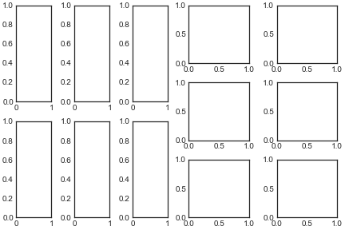

## Complex SubplotSpec.subgridspec

```python
from itertools import product
def squiggle_xy(a, b, c, d, i=np.arange(0.0, 2*np.pi, 0.05)):
	return np.sin(i*a)*np.cos(i*b), np.sin(i*c)*np.cos(i*d)
fig = plt.figure(figsize=(8, 8), constrained_layout=False)
# gridspec inside gridspec
outer_grid = fig.add_gridspec(4, 4, wspace=0.0, hspace=0.0)
for i in range(16):
    inner_grid = outer_grid[i].subgridspec(3, 3, wspace=0.0, hspace=0.0)
    a, b = int(i/4)+1, i % 4+1
    for j, (c, d) in enumerate(product(range(1, 4), repeat=2)):
        ax = plt.Subplot(fig, inner_grid[j])
        ax.plot(*squiggle_xy(a, b, c, d))
        ax.set_xticks([])
        ax.set_yticks([])
        fig.add_subplot(ax)

all_axes = fig.get_axes()
# show only the outside spines
for ax in all_axes:
	for sp in ax.spines.values():
		sp.set_visible(False)
	if ax.is_first_row():
		ax.spines['top'].set_visible(True)
	if ax.is_last_row():
		ax.spines['bottom'].set_visible(True)
	if ax.is_first_col():
		ax.spines['left'].set_visible(True)
	if ax.is_last_col():
		ax.spines['right'].set_visible(True)
plt.show()
```

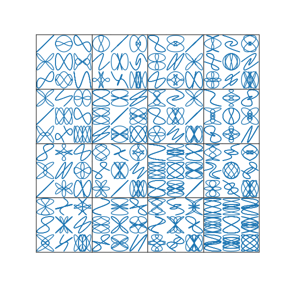

## constrained_layout

* constrained_layout automatically adjusts subplots and decorations like legends and colorbars.

* constrained_layout needs to be activated before any axes are added to a figure.

### params setting

  ```python
plt.subplots(constrained_layout=True)
plt.figure(constrained_layout=True)
  
plt.rcParams['figure.constrained_layout.use'] = True

fig.set_constrained_layout(False) # turn off
plt.set_constrained_layout(False)
  ```

* constrained_layout can also make room for suptitle.

### legend problem

* constrained-layout does not handle legends being created via Figure.legend() (yet).

  ```python
  fig, axs = plt.subplots(1, 2, figsize=(4, 2), constrained_layout=True)
  axs[0].plot(np.arange(10))
  axs[1].plot(np.arange(10), label='This is a plot')
  axs[1].legend(loc='center left', bbox_to_anchor=(0.8, 0.5))
  
  # better way
  fig, axs = plt.subplots(1, 2, figsize=(4, 2), constrained_layout=True)
  axs[0].plot(np.arange(10))
  lines = axs[1].plot(np.arange(10), label='This is a plot')
  labels = [l.get_label() for l in lines]
  leg = fig.legend(lines, labels, loc='center left',
  bbox_to_anchor=(0.8, 0.5), bbox_transform=axs[1].transAxes)
  ```

  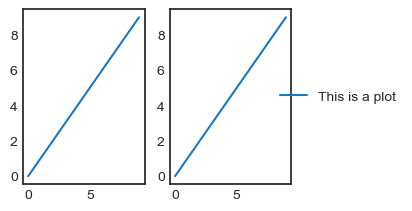

  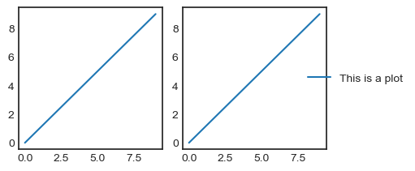

### spacing and padding

> set_constrained_layout_pads()

```python
fig, axs = plt.subplots(2, 2, constrained_layout=True)
for ax in axs.flatten():
    ax.plot([1,2,3],[1,2,3])
    ax.set_xticklabels('')
    ax.set_yticklabels('')
fig.set_constrained_layout_pads(w_pad=2./72., h_pad=2./72.,hspace=0.2, wspace=0.2) #

fig, axs = plt.subplots(2, 2, constrained_layout=True)
for ax in axs.flatten():
    ax.plot([1,2,3],[1,2,3])
    ax.set_xticklabels('')
    ax.set_yticklabels('')
fig.set_constrained_layout_pads(w_pad=8./72., h_pad=8./72.,hspace=0.2, wspace=0.2) #
```

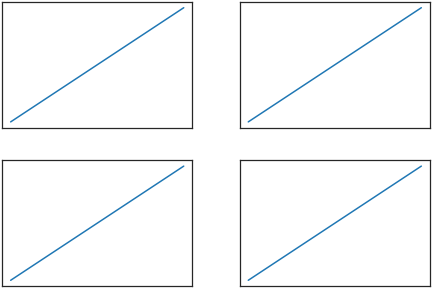

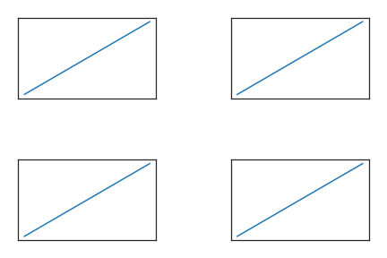

### subplot problem

* constrained_layout will not work on subplots created via the subplot command. The reason
  is that each of these commands creates a separate GridSpec instance and constrained_layout
  uses (nested) gridspecs to carry out the layout. ( that is,using gridspec directly will work well,)

* So the following fails to yield a nice layout:

  ```python
  x = np.arange(100)
  fig = plt.figure()
  ax1 = plt.subplot(221)
  ax2 = plt.subplot(223)
  ax3 = plt.subplot(122)
  ax1.plot(x,x**2)
  ax1.set_xlabel('ax1 xlabel')
  ax2.plot(x,x**3)
  ax2.set_title('ax2 title')
  ax3.plot(x,x**0.5)
  ax3.set_ylabel('ax3 ylabel')
  ```

  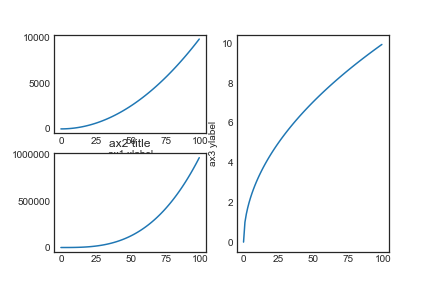

## tight_layout

* use to deal with problems that axis labels or titles (or sometimes even ticklabels) go outside the figure area.

  ```python
  x = np.arange(100)
  fig = plt.figure()
  ax1 = plt.subplot(221)
  ax2 = plt.subplot(223)
  ax3 = plt.subplot(122)
  ax1.plot(x,x**2)
  ax1.set_xlabel('ax1 xlabel')
  ax2.plot(x,x**3)
  ax2.set_title('ax2 title')
  ax3.plot(x,x**0.5)
  ax3.set_ylabel('ax3 ylabel')
  plt.tight_layout(pad=0.4, w_pad=0.5, h_pad=1.0)
  ```

  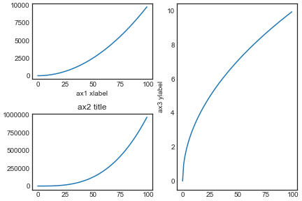

* GridSpec has its own tight_layout() method (the pyplot api tight_layout() also works).

  ```python
  import matplotlib.gridspec as gridspec
  x = np.arange(100)
  
  fig = plt.figure()
  gs1 = gridspec.GridSpec(2, 1)
  ax1 = fig.add_subplot(gs1[0])
  ax2 = fig.add_subplot(gs1[1])
  ax1.plot(x,x**2)
  ax1.set_xlabel('ax1 xlabel')
  ax2.plot(x,x**3)
  ax2.set_title('ax2 title')
  
  gs1.tight_layout(fig, rect=[0, 0, 0.5, 1])
  gs2 = gridspec.GridSpec(3, 1)
  for ss in gs2:
      ax = fig.add_subplot(ss)
      ax.plot(x,x**0.5)
      ax.set_ylabel('ax3 ylabel')
      ax.set_xlabel("")
  ax.set_xlabel("x-label", fontsize=12)
  gs2.tight_layout(fig, rect=[0.5, 0, 1, 1], h_pad=0.5)
  ```

  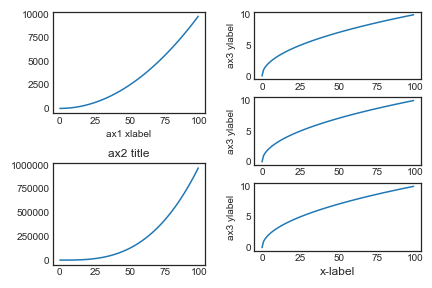

* create a colorbar as a subplot using the gridspec.

* use AxesGrid1 toolkit to explicitly create an axes for colorbar.

  ```python
  plt.close('all')
  arr = np.arange(100).reshape((10, 10))
  fig = plt.figure(figsize=(4, 4))
  im = plt.imshow(arr, interpolation="none")
  plt.colorbar(im, use_gridspec=True)
  plt.tight_layout()
  
  from mpl_toolkits.axes_grid1 import make_axes_locatable
  plt.close('all')
  arr = np.arange(100).reshape((10, 10))
  fig = plt.figure(figsize=(4, 4))
  im = plt.imshow(arr, interpolation="none")
  divider = make_axes_locatable(plt.gca())
  cax = divider.append_axes("right", "5%", pad="3%")
  plt.colorbar(im, cax=cax)
  plt.tight_layout()
  ```

  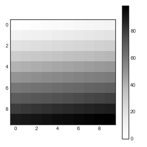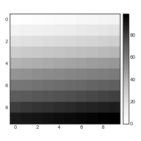

##   axes positions

```python
fig, axs = plt.subplots(1, 2)
for ax in axs:
    ax.plot([1,2,3,4],[1,4,9,16])
axs[1].set_position([0.2, 0.2, 0.4, 0.4])
```


# 推荐函数签名

```
def my_plotter(ax, data1, data2, param_dict):
	"""
	A helper function to make a graph
	Parameters
    ----------
	ax : Axes
	The axes to draw to
    data1 : array
	The x data
	data2 : array
	The y data
	param_dict : dict
	Dictionary of kwargs to pass to ax.plot
	Returns
	-------
	out : list
	list of artists added
	"""
	out = ax.plot(data1, data2, **param_dict)
	return out
# which you would then use as:
data1, data2, data3, data4 = np.random.randn(4, 100)
fig, (ax1, ax2) = plt.subplots(1, 2)
my_plotter(ax1, data1, data2, {'marker': 'x'})
my_plotter(ax2, data3, data4, {'marker': 'o'})
```


# 更改默认的图片格式

```python
mpl.use('PS')
# "svg"、"png"、"jpg"、"pdf" 等
# must be done before importing matplotlib.pyplot or have no effect.
```

# 交互模式

```python
mpl.interactive(Ture/False)
mpl.is_interactive() # query

# also set via
plt.ion()
plt.ioff()

plt.draw() # whenever you want to refresh the plot
```

# 简化

## Line segment simplification 

```python
y = np.random.rand(100000)
y[50000:] *= 2
y[np.logspace(1, np.log10(50000), 400).astype(int)] = -1

fig,(ax1,ax2) = plt.subplots(1,2,figsize=(12,5))

mpl.rcParams['path.simplify'] = True
mpl.rcParams['path.simplify_threshold'] = 0.0
ax1.plot(y)
mpl.rcParams['path.simplify_threshold'] = 1.0
ax2.plot(y)

plt.show()
```


## Marker simplification

```
plt.plot(x, y, markevery=1)
```

## Splitting lines into smaller chunks

```python
fig,(ax1,ax2) = plt.subplots(1,2,figsize=(12,5))
mpl.rcParams['path.simplify_threshold'] = 1.0
# Setup, and create the data to plot
y = np.random.rand(100000)
y[50000:] *= 2
y[np.logspace(1,np.log10(50000), 400).astype(int)] = -1

mpl.rcParams['path.simplify'] = True
mpl.rcParams['agg.path.chunksize'] = 0
ax1.plot(y)
mpl.rcParams['agg.path.chunksize'] = 10000
ax2.plot(y)

plt.show()
```


## Use fast style

```python
# The fast style can be used to automatically set simplification and chunking parameters to reasonable settings to speed up plotting large amounts of data.
mpl.style.use("fast")
```

# 其他有用的api

```python
plt.clf() # clear the current figure 
plt.cla() # clear the current axes 

plt.rcParams.update({'figure.autolayout': True}) #当图形溢出时，可自动调整

fig.canvas.get_supported_filetypes() #list canvas support filetypes
```

## 自定义格式style

```python
'''
# create mpl_configdir/stylelib/presentation.mplstyle
	axes.titlesize : 24
	axes.labelsize : 20
	lines.linewidth : 3l
	ines.markersize : 10
	xtick.labelsize : 16
	ytick.labelsize : 16
'''
import matplotlib.pyplot as plt
plt.style.use('presentation')
plt.style.use(['dark_background', 'presentation']) #composing styles
```

```python
# 临时使用某一格式style
with plt.style.context(('dark_background')):
	plt.plot(np.sin(np.linspace(0, 2 * np.pi)), 'r-o')
plt.show()
```

## 自定义参数 

```python
# matplotlib.rcParams is global to the matplotlib package.
mpl.rcParams['lines.linewidth'] = 2
mpl.rcParams['lines.color'] = 'r'
plt.plot(data)

# convenience functions for modifying rc settings.
mpl.rc('lines', linewidth=4, color='g')
plt.plot(data)

# restore the standard matplotlib default setting
matplotlib.rcdefaults() 
```

## fig.add_axes

```python
'''
fig.add_subplot() # 是Axes的一个特例，具有默认的行列位置
fig.add_axes([left, bottom, width, height]) # 可在任意位置创建子图，参数是相对于画布figure的0-1的数字
fig.delaxes() #删除子图
'''
fig = plt.figure()
fig.subplots_adjust(top=0.8)
ax1 = fig.add_subplot(211)
ax1.set_ylabel('volts')
ax1.set_title('a sine wave')
t = np.arange(0.0, 1.0, 0.01)
s = np.sin(2*np.pi*t)
line, = ax1.plot(t, s, color='blue', lw=2)
# Fixing random state for reproducibility
np.random.seed(19680801)
ax2 = fig.add_axes([0.15, 0.1, 0.7, 0.3])
n, bins, patches = ax2.hist(np.random.randn(1000), 50,
facecolor='yellow', edgecolor='k')
ax2.set_xlabel('time (s)')
plt.show()
```


