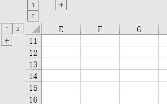
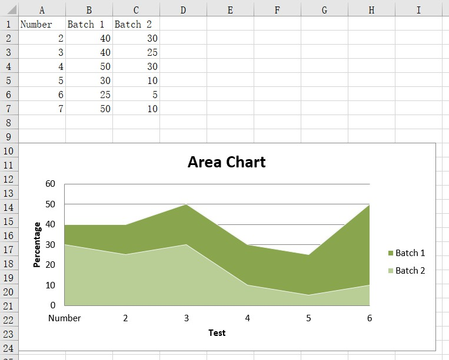

<h1 style="text-align:center;text-weight:40;font-size:30;">openpyxl学习笔记</h1>
<p style="text-align:center;font-family:Lisu;text-size:20">——杨双杰 2019年5月1日</p>

[TOC]

# 读取或者创建excel

## 加载文件/读取工作簿

### 只读取数据

```python
'''
	load_workbook(file,guess_types=False,data_only=False,keep_vba=True)
'''
from openpyxl import load_workbook
wb = load_workbook('name.xlsx',data_only=True)
sheet = wb['sheetname']
print(wb.sheetnames)
```

### 只读模式——加载大数据量

```python
from openpyxl import load_workbook
wb = load_workbook(file,read_only=True) # read_only=True
ws = wb['big_data']
```

###  只写模式

```python
from openpyxl import Workbook
wb = Workbook(write_only=True)
ws = wb.create_sheet()

from openpyxl.cell import WriteOnlyCell # 只写单元格
from openpyxl.comments import Comment # 单元格注释
from openpyxl.styles import Font # 单元格字体

cell = WriteOnlyCell(ws,value='hello world')
cell.font = Font(name='Courier',size=36)
cell.comment = Comment(text='A comment',author="Author's Name")
ws.append([cell,3.14,None])
wb.save("file.xlsx")
```

## 创建工作簿和工作表

```python
from openpyxl import Workbook
wb = Workbook()
ws = wb.active #默认使用第一个工作表

ws.title = 'new title' #更改表名称
ws.sheet_properties.tabColor = '1072BA' #更改表名的背景色
ws_ = wb['new title'] #使用title作为key获得工作表

# 创建工作表，不使用默认active
ws1 = wb.create_sheet('mysheet1') #insert at the end(default)
ws2 = wb.create_sheet('mysheet2',0) #insert at first position

# 创建工作表的副本
wb.copy_worksheet(ws)

# 工作表名
wb.sheetnames

# 遍历工作表
for sheet in wb:
    print(sheet.title)
```

# 操作excel

## 访问单元格数据

```python
cell_value = ws['A4'] #获取值

ws['A4'] = 4 # 赋予值
d = ws.cell(row=4,column=2,value=10) # 行列表示法给单元格赋值

cell_range = ws['A1':'C2'] # 获取单元格范围
colC = ws['C'] # 获取C列的值
colCD = ws['C:D'] # 获取C到D列的值
row10 = ws[10] # 获取第10行的值
row_range = ws[5:10] #获取5到10行的值

# 按行迭代
for row in ws.iter_rows(min_row=1, max_col=3, max_row=2,values_only=True):
    for cell in row:
       print(cell)
# 按列迭代
for row in ws.iter_cols(min_row=1, max_col=3, max_row=2,values_only=True):
    for cell in col:
       print(cell)
# ws.values 只要工作表中的值,功能同values_only=True

# 所有行
ws.rows
# 所有列
ws.columns
```

## 给单元格赋值

```python
# 数字格式
import datetime
ws['A1']=datetime.datetime(2010,7,21)
ws['A1'].number_format # ‘yyyy-mm-dd h:mm:ss'

#公式
ws['A1'] = "=SUM(1,1)"
from openpyxl.utils import FORMULAE
"HEX2DEC" in FORMULAE
```

## 合并/取消合并单元格

```python
# 合并单元格
ws.merge_cells('A2:D2')
ws.merge_cells(start_row=2,start_column=1,end_row=4,end_column=4)

# 取消合并单元格
ws.unmerge_cells('A2:D2')
ws.unmerge_cells(start_row=2,start_column=1,end_row=4,end_column=4)
```

## 插入和删除行列

```python
# openpyxl.worksheet.worksheet.Worksheet.insert_rows()
# openpyxl.worksheet.worksheet.Worksheet.insert_cols()
# openpyxl.worksheet.worksheet.Worksheet.delete_rows()
# openpyxl.worksheet.worksheet.Worksheet.delete_cols()

ws.insert_rows(n) #在第n行插入一行
ws.insert_cols('B') 

ws.delete_rows(n) # 删除第n行
ws.delete_cols(6,3) #从第6列开始，删除3列
```

## 移动单元格范围

```python
ws.move_range('D4:F10',rows=-1,cols=2) # 将D4:F10数据域向上移动一行，向右移动两列
ws.move_range('D4:F10',rows=-1,cols=,translate=True) # 如果单元格包含公式，则translate用于翻译公式，但仅限于单元格中的公式；如果有对其他单元格的引用，则只能使用Parsing Formulas转换程序。
```

## 插入图像

```python
from openpyxl.drawing.image import Image
img = Image('logo.png')
ws.add_image(img,'A1')
```

## 折叠/大纲

```python
ws.column_dimensions.group('A','D',hidden=True)
ws.row_dimensions.group(1,10,hidden=True)
```



```python
# 重置维度
ws.reset_dimensions(max_row,max_column)
```

## 创建表格

```python
from openpyxl import Workbook
from openpyxl.worksheet.table import Table, TableStyleInfo

wb = Workbook()
ws = wb.active

data = [
    ['Apples', 10000, 5000, 8000, 6000],
    ['Pears',   2000, 3000, 4000, 5000],
    ['Bananas', 6000, 6000, 6500, 6000],
    ['Oranges',  500,  300,  200,  700],
]

# add column headings. NB. these must be strings
ws.append(["Fruit", "2011", "2012", "2013", "2014"])
for row in data:
    ws.append(row)

tab = Table(displayName="Table1", ref="A1:E5")

# Add a default style with striped rows and banded columns
style = TableStyleInfo(name="TableStyleMedium9", showFirstColumn=False,
                       showLastColumn=False, showRowStripes=True, showColumnStripes=True)
tab.tableStyleInfo = style
ws.add_table(tab)
wb.save("table.xlsx")
```

## 筛选和排序

```python
from openpyxl import Workbook

wb = Workbook()
ws = wb.active

data = [
    ["Fruit", "Quantity"],
    ["Kiwi", 3],
    ["Grape", 15],
    ["Apple", 3],
    ["Peach", 3],
    ["Pomegranate", 3],
    ["Pear", 3],
    ["Tangerine", 3],
    ["Blueberry", 3],
    ["Mango", 3],
    ["Watermelon", 3],
    ["Blackberry", 3],
    ["Orange", 3],
    ["Raspberry", 3],
    ["Banana", 3]
]

for r in data:
    ws.append(r)

ws.auto_filter.ref = "A1:B15"
ws.auto_filter.add_filter_column(0, ["Kiwi", "Apple", "Mango"]) #默认选中
ws.auto_filter.add_sort_condition("B2:B15")

wb.save("filtered.xlsx")
```

## 单元格验证

### 类别选项:

```python
from openpyxl import Workbook
from openpyxl.worksheet.datavalidation import DataValidation

# Create the workbook and worksheet we'll be working with
wb = Workbook()
ws = wb.active

# Create a data-validation object with list validation
dv = DataValidation(type="list", formula1='"Dog,Cat,Bat"', allow_blank=True)

# Optionally set a custom error message
dv.error ='Your entry is not in the list'
dv.errorTitle = 'Invalid Entry'

# Optionally set a custom prompt message
dv.prompt = 'Please select from the list'
dv.promptTitle = 'List Selection'

# Add the data-validation object to the worksheet
ws.add_data_validation(dv)

# Create some cells, and add them to the data-validation object
c1 = ws["A1"]
c1.value = "Dog"
dv.add(c1)
c2 = ws["A2"]
c2.value = "An invalid value"
dv.add(c2)
# Or, apply the validation to a range of cells
dv.add('B1:B1048576') # This is the same as for the whole of column B
```

### 任何整数：

```python
dv = DataValidation(type="whole")
```

### 100以上的任何整数：

```python
dv = DataValidation(type="whole",
                    operator="greaterThan",
                    formula1=100)
```

### 任何十进制数：

```python
dv = DataValidation(type="decimal")
```

### 0到1之间的任何十进制数：

```python
dv = DataValidation(type="decimal",
                    operator="between",
                    formula1=0,
                    formula2=1)
```

### 任何日期：

```python
dv = DataValidation(type="date")
```

### 或时间：

```python
dv = DataValidation(type="time")
```

### 任何字符串最多15个字符：

```python
dv = DataValidation(type="textLength",
                    operator="lessThanOrEqual"),
                    formula1=15)
```

### 细胞范围验证：

```python
from openpyxl.utils import quote_sheetname
dv = DataValidation(type="list",
                    formula1="{0}!$B$1:$B$10".format(quote_sheetname(sheetname))
                    )
```

### 自定义规则：

```python
dv = DataValidation(type="custom",
                    formula1"=SOMEFORMULA")
```

## 注释

### 添加注释

```python
from openpyxl.comments import Comment
wb = Workbook()
ws = wb.active

comment = Comment('text','author')
ws['A1'].comment = comment
# comment.text
# comment.author
```

### 加载和保存注释

* 加载时格式化信息会丢失
* 可以为只写指定注释尺寸

```python
from openpyxl import Workbook
from openpyxl.comments import Comment
from openpyxl.utils import units

wb = Workbook()
ws = wb.active

comment = Comment("text","author")
comment.width = 300
comment.height = 50
'''
单位转换为像素：
# comment.width = units.points_to_pixels(300)
# comment.height = units.points_to_pixels(50)
'''

ws['A1'].comment = comment

wb.save('file.xlsx')
```

## 数据透视表

* openpyxl为数据透视表提供读取支持
* 目前没有透视表的管理API，客户端代码必须循环遍历`_pivots`工作表列表

```python
from openpyxl import load_workbook
wb = load_workbook("campaign.xlsx")
ws = wb["Results"]
pivot = ws._pivots[0] # any will do as they share the same cache
pivot.cache.refreshOnload = True
```

## 解析公式

```python
from openpyxl.formula import Tokenizer
tok = Tokenizer("""=IF($A$1,"then True",MAX(DEFAULT_VAL,'Sheet 2'!B1))""")
print("\n".join("%12s%11s%9s" % (t.value, t.type, t.subtype) for t in tok.items))
```

> 将公式从一个位置转换为另一个位置

```python
from openpyxl.formula.translate import Translator
ws['F2'] = "=SUM(B2:E2)"
# move the formula one colum to the right
ws['G2'] = Translator("=SUM(B2:E2)", origin="F2").translate_formula("G2")
ws['G2'].value #'=SUM(C2:F2)'
```

# 样式

## 默认样式

```python
from openpyxl.styles import PatternFill, Border, Side, Alignment, Protection, Font
from copy import copy

font = Font(name='Calibri',size=11,bold=False,italic=False,vertAlign=None,
            underline='none',strike=False,color='FF000000')
# font_copy = copy(font)

fill = PatternFill(fill_type=None,start_color='FFFFFFFF',end_color='FF000000')

border = Border(
    			left=Side(border_style=None,color='FF000000'),
                right=Side(border_style=None,color='FF000000'),
                top=Side(border_style=None,color='FF000000'),
                bottom=Side(border_style=None,color='FF000000'),
                diagonal=Side(border_style=None,color='FF000000'),
                diagonal_direction=0,
                outline=Side(border_style=None,color='FF000000'),
                vertical=Side(border_style=None,color='FF000000'),
                horizontal=Side(border_style=None,color='FF000000')
                )

alignment=Alignment(horizontal='general',vertical='bottom',text_rotation=0,
                     wrap_text=False,shrink_to_fit=False,indent=0)

number_format = 'General'

protection = Protection(locked=True,hidden=False)
```

## 单元格样式

```python
from openpyxl.styles import colors
from openpyxl.styles import Font,Color

a1 = ws['A1']
d4 = ws['D4']

a1.font = Font(color=colors.RED)
d4.font = Font(color=colors.RED)

# a1.font.italic = True
a1.font = Font(color=colors.RED,italic=True) 

# 复制样式
from copy import copy
ft = Font(name='Arial',size=14)
ft2 = copy(ft)
ft2.name = 'Consola'
```

## 行列样式

```python
col = ws.column_dimensions['A']
col.font = Font(bold=True)

row = ws.row_dimensions[1]
row.font = Font(underline='single')
```

## 合并单元格样式

```python
from openpyxl.styles import Border, Side, PatternFill, Font, GradientFill, Alignment
from openpyxl import Workbook

wb = Workbook()
ws = wb.active
ws.merge_cells('B2:F4')

top_left_cell = ws['B2']
top_left_cell.value = "My Cell"

thin = Side(border_style="thin", color="000000") #边框对象
double = Side(border_style="double", color="ff0000") #边框对象

top_left_cell.border = Border(top=double, left=thin, right=thin, bottom=double) #边框属性
top_left_cell.fill = PatternFill("solid", fgColor="DDDDDD") #背景填充
top_left_cell.fill = fill = GradientFill(stop=("000000", "FFFFFF")) #渐变填充
top_left_cell.font  = Font(b=True, color="FF0000") #字体
top_left_cell.alignment = Alignment(horizontal="center", vertical="center")#对齐方式

wb.save("styled.xlsx")
```

## 命名样式

```python
from openpyxl.styles import NamedStyle,Font,Border,Side
highlight = NamedStyle(name='highlight')
highlight.font = Font(bold=True,size=20)
highlight.border = Border(left=Side(style='thick',color='000000'),
                         right,top,bottom)
# 注册
wb.add_named_style(highlight)
# 或者
ws['A1'].style = highlight

# 注册后，仅使用名称指定样式
ws['D5'].style = 'highlight' 
```

## 页面样式

```python
from openpyxl.workbook import Workbook
wb = Workbook()
ws = wb.active
ws.page_setup.orientation = ws.ORIENTATION_LANDSCAPE
ws.page_setup.paperSize = ws.PAPERSIZE_TABLOID
ws.page_setup.fitToHeight = 0
ws.page_setup.fitToWidth = 1
```

### Available properties for worksheets

* “enableFormatConditionsCalculation”
* “filterMode”
* “published”
* “syncHorizontal”
* “syncRef”
* “syncVertical”
* “transitionEvaluation”
* “transitionEntry”
* “tabColor”

### Available fields for page setup properties

“autoPageBreaks” “fitToPage”

### Available fields for outlines

* “applyStyles”
* “summaryBelow”
* “summaryRight”
* “showOutlineSymbols”

```python
from openpyxl.workbook import Workbook
from openpyxl.worksheet.properties import WorksheetProperties, PageSetupProperties
wb = Workbook()
ws = wb.active
wsprops = ws.sheet_properties
wsprops.tabColor = "1072BA"
wsprops.filterMode = False
wsprops.pageSetUpPr = PageSetupProperties(fitToPage=True, autoPageBreaks=False)
wsprops.outlinePr.summaryBelow = False
wsprops.outlinePr.applyStyles = True
wsprops.pageSetUpPr.autoPageBreaks = True
```

## 内置样式

* ‘Normal’ # same as no style

| Number formats                                               | Informative                                                  |
| ------------------------------------------------------------ | ------------------------------------------------------------ |
| *  'Comma' <br />*  'Comma[0]'<br />*  'Currency'<br />*  'Currency[0]'<br />*  'Percent' | * 'Calculation'<br />* 'Total'<br />* 'Note'<br />* 'Warning Text'<br />* 'Explanatory Text' |
| <b>Text styles</b>                                           | <b>Comparisons</b>                                           |
| *  'Title'<br/>*  'Headline 1'<br/>*  'Headline 2'<br/>*  'Headline 3'<br/>*  'Headline 4'<br/>*  'Hyperlink'<br/>*  'Followed Hyperlink'<br/>*  'Linked Cell' | *  'Input'<br/>*  'Output'<br/>*  'Check Cell'<br/>*  'Good'<br/>*  'Bad'<br/>*  'Neutral' |
| <b>Highlights</b>                                            |                                                              |
| *  'Accent1'<br/>*  '20 % - Accent1'<br/>*  '40 % - Accent1'<br/>*  '60 % - Accent1'<br/>*  'Pandas'<br />#类似的有Accent2—Accent6 |                                                              |

# 格式

## 内置格式

### ColorScale

#### 完整语法

```python
from openpyxl.formatting.rule import ColorScale, FormatObject
from openpyxl.styles import Color
first = FormatObject(type='min')
last = FormatObject(type='max')
# colors match the format objects:
colors = [Color('AA0000'), Color('00AA00')]
cs2 = ColorScale(cfvo=[first, last], color=colors)
# a three color scale would extend the sequences
mid = FormatObject(type='num', val=40)
colors.insert(1, Color('00AA00'))
cs3 = ColorScale(cfvo=[first, mid, last], color=colors)
# create a rule with the color scale
from openpyxl.formatting.rule import Rule
rule = Rule(type='colorScale', colorScale=cs3
```

#### 便利语法

```python
from openpyxl.formatting.rule import ColorScaleRule
rule = ColorScaleRule(start_type='percentile', start_value=10,start_color='FFAA0000',
                      mid_type='percentile', mid_value=50,mid_color='FF0000AA',
                      end_type='percentile', end_value=90, end_color='FF00AA00')
```

### IconSet

* '3Arrows'，'3ArrowsGray'，'3Flags'，'3TrafficLights1'，'3TrafficLights2'，'3Signs'，'3Symbols'，'3Symbols2'，'4Arrows'，'4ArrowsGray'，'4RedToBlack'，'4Rating'，'4TrafficLights'，'5Arrows'，'5ArrowsGray'，'5Rating'，'5Quarters'

#### 完整语法

```python
from openpyxl.formatting.rule import IconSet, FormatObject
first = FormatObject(type='percent', val=0)
second = FormatObject(type='percent', val=33)
third = FormatObject(type='percent', val=67)
iconset = IconSet(iconSet='3TrafficLights1', cfvo=[first, second, third], showValue=None, percent=None, reverse=None)
# assign the icon set to a rule
from openpyxl.formatting.rule import Rule
rule = Rule(type='iconSet', iconSet=iconset)
```

#### 便利语法

```python
from openpyxl.formatting.rule import IconSetRule
rule = IconSetRule('5Arrows', 'percent', 
                   [10, 20, 30, 40, 50],
                   showValue=None, percent=None, 
                   reverse=None)
```

### DataBar

#### 完整语法

```python
from openpyxl.formatting.rule import DataBar, FormatObject
first = FormatObject(type='min')
second = FormatObject(type='max')
data_bar = DataBar(cfvo=[first, second], color="638EC6", 
                   showValue=None, minLength=None, maxLength=None)
# assign the data bar to a rule
from openpyxl.formatting.rule import Rule
rule = Rule(type='dataBar', dataBar=data_bar)
```

#### 便利语法

```python
from openpyxl.formatting.rule import DataBarRule
rule = DataBarRule(start_type='percentile', start_value=10, 
                   end_type='percentile', end_value='90',
                   color="FF638EC6", showValue="None", 
                   minLength=None, maxLength=None)
```

## 标准条件格式

* Average
* Percent
* Unique or duplicate
* Value
* Rank

```python
from openpyxl import Workbook
from openpyxl.styles import Color, PatternFill, Font, Border
from openpyxl.styles.differential import DifferentialStyle
from openpyxl.formatting.rule import ColorScaleRule, CellIsRule, FormulaRule
from openpyxl.formatting import Rule
wb = Workbook()
ws = wb.active

# Create fill
redFill = PatternFill(start_color='EE1111',
                end_color='EE1111',
                fill_type='solid')

# Add a two-color scale
# Takes colors in excel 'RRGGBB' style.
ws.conditional_formatting.add('A1:A10',
             ColorScaleRule(start_type='min', start_color='AA0000',
                           end_type='max', end_color='00AA00')
                           )

# Add a three-color scale
ws.conditional_formatting.add('B1:B10',
                ColorScaleRule(start_type='percentile', start_value=10, 
                               start_color='AA0000',mid_type='percentile', 
                               mid_value=50, mid_color='0000AA',
                               end_type='percentile', end_value=90, end_color='00AA00')
                              )

# Add a conditional formatting based on a cell comparison
# addCellIs(range_string, operator, formula, stopIfTrue, wb, font, border, fill)

# Format if cell is less than 'formula'
ws.conditional_formatting.add('C2:C10',
             CellIsRule(operator='lessThan', formula=['C$1'], 
                        stopIfTrue=True, fill=redFill)
                             )

# Format if cell is between 'formula'
ws.conditional_formatting.add('D2:D10',
             CellIsRule(operator='between', formula=['1','5'], 
                        stopIfTrue=True, fill=redFill)
                             )

# Format using a formula
ws.conditional_formatting.add('E1:E10',
             FormulaRule(formula=['ISBLANK(E1)'], stopIfTrue=True, fill=redFill))

# Aside from the 2-color and 3-color scales, format rules take fonts, borders and fills for styling:
myFont = Font()
myBorder = Border()
ws.conditional_formatting.add('E1:E10',
             FormulaRule(formula=['E1=0'], font=myFont, border=myBorder, fill=redFill))

# Highlight cells that contain particular text by using a special formula
red_text = Font(color="9C0006")
red_fill = PatternFill(bgColor="FFC7CE")
dxf = DifferentialStyle(font=red_text, fill=red_fill)

rule = Rule(type="containsText", operator="containsText", text="highlight", dxf=dxf)
rule.formula = ['NOT(ISERROR(SEARCH("highlight",A1)))']
ws.conditional_formatting.add('A1:F40', rule)
wb.save("test.xlsx")
```

## 格式化整行

```python
ws.append(['Software', 'Developer', 'Version'])
ws.append(['Excel', 'Microsoft', '2016'])
ws.append(['openpyxl', 'Open source', '2.6'])
ws.append(['OpenOffice', 'Apache', '4.1.4'])
ws.append(['Word', 'Microsoft', '2010'])

# 高亮显示开发人员是Microsoft
red_fill = PatternFill(bgColor="FFC7CE")
dxf = DifferentialStyle(fill=red_fill)
r = Rule(type="expression", dxf=dxf, stopIfTrue=True)
r.formula = ['$A2="Microsoft"']
ws.conditional_formatting.add("A1:C10", r)
```

# 保存excel

```python
# 保存为xlsx
wb.save('wbname.xlsx')

# 保存为流stream
from tempfile import NamedTemporaryFile
from openpyxl import Workbook
wb = Workbook()
with NamedTemporaryFile() as tmp:
    wb.save(tmp.name)
    tmp.seek(0)
    stream = tmp.read()

# 保存为模板
wb = load_workbook('document.xlsx')
wb.template = True
wb.save('document_template.xltx')

# 将模板设置为False以保存为文档
wb = load_workbook('document_template.xltx')
wb.template = False
wb.save('document.xlsx', as_template=False)
```

# 对Pandas和Numpy的支持

```python
# df_to_ws
from openpyxl.utils.dataframe import dataframe_to_rows
for row in dataframe_to_rows(df,index=True,header=True):
    ws.append(row)

for cell in ws['A']+ws[1]: # 突出显示行列索引
    cell.style = 'Pandas'

# ws_to_df
df = pd.DataFrame(ws.values) #不含index和columns

data = ws.values #不含index与columns时 
cols = next(data)[1:]
data = list(data)
idx = [r[0] for r in data]
data = (islice(r,1,None) for r in data)
df = pd.DataFrame(data,index=idx,columns=cols) 
```

# 保护工作簿与工作表

```python
# 保护工作簿
wb.security.workbookPassword = '...'
wb.security.lockStructure = True
wb.security.revisionsPassword = '...'

hashed_password = ...
wb.security.set_workbook_password(hashed_password, already_hashed=True)

# 保护工作表
ws = wb.active
wb.protection.sheet = True
wb.protection.enable()
wb.protection.disable()

ws = wb.active
ws.protection.password = '...'
```

# 操作excel图表

## basic charts

### area charts

#### 2D area charts

* `“standard(default)”, “stacked” or “percentStacked”`

```python
from openpyxl import Workbook
from openpyxl.chart import AreaChart,Reference,Series

wb = Workbook()
ws = wb.active

rows = [
    ['Number', 'Batch 1', 'Batch 2'],
    [2, 40, 30],
    [3, 40, 25],
    [4, 50, 30],
    [5, 30, 10],
    [6, 25, 5],
    [7, 50, 10],
]

for row in rows:
    ws.append(row)

chart = AreaChart()
chart.title = "Area Chart"
chart.style = 13
chart.x_axis.title = 'Test'
chart.y_axis.title = 'Percentage'

cats = Reference(ws, min_col=1, min_row=1, max_row=7)
data = Reference(ws, min_col=2, min_row=1, max_col=3, max_row=7)
chart.add_data(data, titles_from_data=True)
chart.set_categories(cats)

ws.add_chart(chart, "A10")

wb.save("area.xlsx")
```



#### 3D area charts

```python
from openpyxl import Workbook
from openpyxl.chart import (
    AreaChart3D,
    Reference,
    Series,
)

wb = Workbook()
ws = wb.active

rows = [
    ['Number', 'Batch 1', 'Batch 2'],
    [2, 30, 40],
    [3, 25, 40],
    [4 ,30, 50],
    [5 ,10, 30],
    [6,  5, 25],
    [7 ,10, 50],
]

for row in rows:
    ws.append(row)

chart = AreaChart3D()
chart.title = "Area Chart"
chart.style = 13
chart.x_axis.title = 'Test'
chart.y_axis.title = 'Percentage'
chart.legend = None

cats = Reference(ws, min_col=1, min_row=1, max_row=7)
data = Reference(ws, min_col=2, min_row=1, max_col=3, max_row=7)
chart.add_data(data, titles_from_data=True)
chart.set_categories(cats)

ws.add_chart(chart, "A10")

wb.save("area3D.xlsx")
```


### bar charts

#### 2D bar charts

```python
from openpyxl import Workbook
from openpyxl.chart import BarChart, Series, Reference

wb = Workbook(write_only=True)
ws = wb.create_sheet()

rows = [
    ('Number', 'Batch 1', 'Batch 2'),
    (2, 10, 30),
    (3, 40, 60),
    (4, 50, 70),
    (5, 20, 10),
    (6, 10, 40),
    (7, 50, 30),
]

for row in rows:
    ws.append(row)

chart1 = BarChart()
chart1.type = "col"
chart1.style = 10
chart1.title = "Bar Chart"
chart1.y_axis.title = 'Test number'
chart1.x_axis.title = 'Sample length (mm)'

data = Reference(ws, min_col=2, min_row=1, max_row=7, max_col=3)
cats = Reference(ws, min_col=1, min_row=2, max_row=7)
chart1.add_data(data, titles_from_data=True)
chart1.set_categories(cats)
chart1.shape = 4
ws.add_chart(chart1, "A10")

from copy import deepcopy

chart2 = deepcopy(chart1)
chart2.style = 11
chart2.type = "bar"
chart2.title = "Horizontal Bar Chart"
ws.add_chart(chart2, "G10")

chart3 = deepcopy(chart1)
chart3.type = "col"
chart3.style = 12
chart3.grouping = "stacked"
chart3.overlap = 100
chart3.title = 'Stacked Chart'
ws.add_chart(chart3, "A27")

chart4 = deepcopy(chart1)
chart4.type = "bar"
chart4.style = 13
chart4.grouping = "percentStacked"
chart4.overlap = 100
chart4.title = 'Percent Stacked Chart'
ws.add_chart(chart4, "G27")

wb.save("bar.xlsx")
```


#### 3D bar charts

```python
from openpyxl import Workbook
from openpyxl.chart import (
    Reference,
    Series,
    BarChart3D,
)

wb = Workbook()
ws = wb.active

rows = [
    (None, 2013, 2014),
    ("Apples", 5, 4),
    ("Oranges", 6, 2),
    ("Pears", 8, 3)
]

for row in rows:
    ws.append(row)

data = Reference(ws, min_col=2, min_row=1, max_col=3, max_row=4)
titles = Reference(ws, min_col=1, min_row=2, max_row=4)
chart = BarChart3D()
chart.title = "3D Bar Chart"
chart.add_data(data=data, titles_from_data=True)
chart.set_categories(titles)

ws.add_chart(chart, "E5")
wb.save("bar3d.xlsx")
```


### bubble charts

> 气泡图类似于散点图，但使用第三维来确定气泡的大小。图表可以包含多个系列。

```python
"""
Sample bubble chart
"""

from openpyxl import Workbook
from openpyxl.chart import Series, Reference, BubbleChart

wb = Workbook()
ws = wb.active

rows = [
    ("Number of Products", "Sales in USD", "Market share"),
    (14, 12200, 15),
    (20, 60000, 33),
    (18, 24400, 10),
    (22, 32000, 42),
    (),
    (12, 8200, 18),
    (15, 50000, 30),
    (19, 22400, 15),
    (25, 25000, 50),
]

for row in rows:
    ws.append(row)

chart = BubbleChart()
chart.style = 18 # use a preset style

# add the first series of data
xvalues = Reference(ws, min_col=1, min_row=2, max_row=5)
yvalues = Reference(ws, min_col=2, min_row=2, max_row=5)
size = Reference(ws, min_col=3, min_row=2, max_row=5)
series = Series(values=yvalues, xvalues=xvalues, zvalues=size, title="2013")
chart.series.append(series)

# add the second
xvalues = Reference(ws, min_col=1, min_row=7, max_row=10)
yvalues = Reference(ws, min_col=2, min_row=7, max_row=10)
size = Reference(ws, min_col=3, min_row=7, max_row=10)
series = Series(values=yvalues, xvalues=xvalues, zvalues=size, title="2014")
chart.series.append(series)

# place the chart starting in cell E1
ws.add_chart(chart, "E1")
wb.save("bubble.xlsx")
```


### Line charts

#### 2D line charts

```python
from datetime import date

from openpyxl import Workbook
from openpyxl.chart import (
    LineChart,
    Reference,
)
from openpyxl.chart.axis import DateAxis

wb = Workbook()
ws = wb.active

rows = [
    ['Date', 'Batch 1', 'Batch 2', 'Batch 3'],
    [date(2015,9, 1), 40, 30, 25],
    [date(2015,9, 2), 40, 25, 30],
    [date(2015,9, 3), 50, 30, 45],
    [date(2015,9, 4), 30, 25, 40],
    [date(2015,9, 5), 25, 35, 30],
    [date(2015,9, 6), 20, 40, 35],
]

for row in rows:
    ws.append(row)

c1 = LineChart()
c1.title = "Line Chart"
c1.style = 13
c1.y_axis.title = 'Size'
c1.x_axis.title = 'Test Number'

data = Reference(ws, min_col=2, min_row=1, max_col=4, max_row=7)
c1.add_data(data, titles_from_data=True)

# Style the lines
s1 = c1.series[0]
s1.marker.symbol = "triangle"
s1.marker.graphicalProperties.solidFill = "FF0000" # Marker filling
s1.marker.graphicalProperties.line.solidFill = "FF0000" # Marker outline

s1.graphicalProperties.line.noFill = True

s2 = c1.series[1]
s2.graphicalProperties.line.solidFill = "00AAAA"
s2.graphicalProperties.line.dashStyle = "sysDot"
s2.graphicalProperties.line.width = 100050 # width in EMUs

s2 = c1.series[2]
s2.smooth = True # Make the line smooth

ws.add_chart(c1, "A10")

from copy import deepcopy
stacked = deepcopy(c1)
stacked.grouping = "stacked"
stacked.title = "Stacked Line Chart"
ws.add_chart(stacked, "A27")

percent_stacked = deepcopy(c1)
percent_stacked.grouping = "percentStacked"
percent_stacked.title = "Percent Stacked Line Chart"
ws.add_chart(percent_stacked, "A44")

# Chart with date axis
c2 = LineChart()
c2.title = "Date Axis"
c2.style = 12
c2.y_axis.title = "Size"
c2.y_axis.crossAx = 500
c2.x_axis = DateAxis(crossAx=100)
c2.x_axis.number_format = 'd-mmm'
c2.x_axis.majorTimeUnit = "days"
c2.x_axis.title = "Date"

c2.add_data(data, titles_from_data=True)
dates = Reference(ws, min_col=1, min_row=2, max_row=7)
c2.set_categories(dates)

ws.add_chart(c2, "A61")

wb.save("line.xlsx")
```


#### 3D charts

```python
from datetime import date

from openpyxl import Workbook
from openpyxl.chart import (
    LineChart3D,
    Reference,
)
from openpyxl.chart.axis import DateAxis

wb = Workbook()
ws = wb.active

rows = [
    ['Date', 'Batch 1', 'Batch 2', 'Batch 3'],
    [date(2015,9, 1), 40, 30, 25],
    [date(2015,9, 2), 40, 25, 30],
    [date(2015,9, 3), 50, 30, 45],
    [date(2015,9, 4), 30, 25, 40],
    [date(2015,9, 5), 25, 35, 30],
    [date(2015,9, 6), 20, 40, 35],
]

for row in rows:
    ws.append(row)

c1 = LineChart3D()
c1.title = "3D Line Chart"
c1.legend = None
c1.style = 15
c1.y_axis.title = 'Size'
c1.x_axis.title = 'Test Number'

data = Reference(ws, min_col=2, min_row=1, max_col=4, max_row=7)
c1.add_data(data, titles_from_data=True)

ws.add_chart(c1, "A10")

wb.save("line3D.xlsx")
```


### scatter charts

```python
from openpyxl import Workbook
from openpyxl.chart import (
    ScatterChart,
    Reference,
    Series,
)

wb = Workbook()
ws = wb.active

rows = [
    ['Size', 'Batch 1', 'Batch 2'],
    [2, 40, 30],
    [3, 40, 25],
    [4, 50, 30],
    [5, 30, 25],
    [6, 25, 35],
    [7, 20, 40],
]

for row in rows:
    ws.append(row)

chart = ScatterChart()
chart.title = "Scatter Chart"
chart.style = 13
chart.x_axis.title = 'Size'
chart.y_axis.title = 'Percentage'

xvalues = Reference(ws, min_col=1, min_row=2, max_row=7)
for i in range(2, 4):
    values = Reference(ws, min_col=i, min_row=1, max_row=7)
    series = Series(values, xvalues, title_from_data=True)
    chart.series.append(series)

ws.add_chart(chart, "A10")

wb.save("scatter.xlsx")
```


### pie charts

#### 2D pie charts

```python
from openpyxl import Workbook

from openpyxl.chart import (
    PieChart,
    ProjectedPieChart,
    Reference
)
from openpyxl.chart.series import DataPoint

data = [
    ['Pie', 'Sold'],
    ['Apple', 50],
    ['Cherry', 30],
    ['Pumpkin', 10],
    ['Chocolate', 40],
]

wb = Workbook()
ws = wb.active

for row in data:
    ws.append(row)

pie = PieChart()
labels = Reference(ws, min_col=1, min_row=2, max_row=5)
data = Reference(ws, min_col=2, min_row=1, max_row=5)
pie.add_data(data, titles_from_data=True)
pie.set_categories(labels)
pie.title = "Pies sold by category"

# Cut the first slice out of the pie
slice = DataPoint(idx=0, explosion=20)
pie.series[0].data_points = [slice]

ws.add_chart(pie, "D1")


ws = wb.create_sheet(title="Projection")

data = [
    ['Page', 'Views'],
    ['Search', 95],
    ['Products', 4],
    ['Offers', 0.5],
    ['Sales', 0.5],
]

for row in data:
    ws.append(row)

projected_pie = ProjectedPieChart()
projected_pie.type = "pie"
projected_pie.splitType = "val" # split by value
labels = Reference(ws, min_col=1, min_row=2, max_row=5)
data = Reference(ws, min_col=2, min_row=1, max_row=5)
projected_pie.add_data(data, titles_from_data=True)
projected_pie.set_categories(labels)

ws.add_chart(projected_pie, "A10")

from copy import deepcopy
projected_bar = deepcopy(projected_pie)
projected_bar.type = "bar"
projected_bar.splitType = 'pos' # split by position

ws.add_chart(projected_bar, "A27")

wb.save("pie.xlsx")
```


#### 3D pie charts

```python
from openpyxl import Workbook

from openpyxl.chart import (
    PieChart3D,
    Reference
)

data = [
    ['Pie', 'Sold'],
    ['Apple', 50],
    ['Cherry', 30],
    ['Pumpkin', 10],
    ['Chocolate', 40],
]

wb = Workbook()
ws = wb.active

for row in data:
    ws.append(row)

pie = PieChart3D()
labels = Reference(ws, min_col=1, min_row=2, max_row=5)
data = Reference(ws, min_col=2, min_row=1, max_row=5)
pie.add_data(data, titles_from_data=True)
pie.set_categories(labels)
pie.title = "Pies sold by category"


ws.add_chart(pie, "D1")

wb.save("pie3D.xlsx")
```


### doughnut charts

```python
from openpyxl import Workbook

from openpyxl.chart import (
    DoughnutChart,
    Reference,
    Series,
)
from openpyxl.chart.series import DataPoint

data = [
    ['Pie', 2014, 2015],
    ['Plain', 40, 50],
    ['Jam', 2, 10],
    ['Lime', 20, 30],
    ['Chocolate', 30, 40],
]

wb = Workbook()
ws = wb.active

for row in data:
    ws.append(row)

chart = DoughnutChart()
labels = Reference(ws, min_col=1, min_row=2, max_row=5)
data = Reference(ws, min_col=2, min_row=1, max_row=5)
chart.add_data(data, titles_from_data=True)
chart.set_categories(labels)
chart.title = "Doughnuts sold by category"
chart.style = 26

# Cut the first slice out of the doughnut
slices = [DataPoint(idx=i) for i in range(4)]
plain, jam, lime, chocolate = slices
chart.series[0].data_points = slices
plain.graphicalProperties.solidFill = "FAE1D0"
jam.graphicalProperties.solidFill = "BB2244"
lime.graphicalProperties.solidFill = "22DD22"
chocolate.graphicalProperties.solidFill = "61210B"
chocolate.explosion = 10

ws.add_chart(chart, "E1")

from copy import deepcopy

chart2 = deepcopy(chart)
chart2.title = None
data = Reference(ws, min_col=3, min_row=1, max_row=5)
series2 = Series(data, title_from_data=True)
series2.data_points = slices
chart2.series.append(series2)

ws.add_chart(chart2, "E17")

wb.save("doughnut.xlsx")
```


### radar charts

```python
from openpyxl import Workbook
from openpyxl.chart import (
    RadarChart,
    Reference,
)

wb = Workbook()
ws = wb.active

rows = [
    ['Month', "Bulbs", "Seeds", "Flowers", "Trees & shrubs"],
    ['Jan', 0, 2500, 500, 0,],
    ['Feb', 0, 5500, 750, 1500],
    ['Mar', 0, 9000, 1500, 2500],
    ['Apr', 0, 6500, 2000, 4000],
    ['May', 0, 3500, 5500, 3500],
    ['Jun', 0, 0, 7500, 1500],
    ['Jul', 0, 0, 8500, 800],
    ['Aug', 1500, 0, 7000, 550],
    ['Sep', 5000, 0, 3500, 2500],
    ['Oct', 8500, 0, 2500, 6000],
    ['Nov', 3500, 0, 500, 5500],
    ['Dec', 500, 0, 100, 3000 ],
]

for row in rows:
    ws.append(row)

chart = RadarChart()
chart.type = "filled"
labels = Reference(ws, min_col=1, min_row=2, max_row=13)
data = Reference(ws, min_col=2, max_col=5, min_row=1, max_row=13)
chart.add_data(data, titles_from_data=True)
chart.set_categories(labels)
chart.style = 26
chart.title = "Garden Centre Sales"
chart.y_axis.delete = True

ws.add_chart(chart, "A17")

wb.save("radar.xlsx")
```


### stock charts

```python
from datetime import date

from openpyxl import Workbook

from openpyxl.chart import (
    BarChart,
    StockChart,
    Reference,
    Series,
)
from openpyxl.chart.axis import DateAxis, ChartLines
from openpyxl.chart.updown_bars import UpDownBars

wb = Workbook()
ws = wb.active

rows = [
   ['Date',      'Volume','Open', 'High', 'Low', 'Close'],
   ['2015-01-01', 20000,    26.2, 27.20, 23.49, 25.45,  ],
   ['2015-01-02', 10000,    25.45, 25.03, 19.55, 23.05, ],
   ['2015-01-03', 15000,    23.05, 24.46, 20.03, 22.42, ],
   ['2015-01-04', 2000,     22.42, 23.97, 20.07, 21.90, ],
   ['2015-01-05', 12000,    21.9, 23.65, 19.50, 21.51,  ],
]

for row in rows:
    ws.append(row)

# High-low-close
c1 = StockChart()
labels = Reference(ws, min_col=1, min_row=2, max_row=6)
data = Reference(ws, min_col=4, max_col=6, min_row=1, max_row=6)
c1.add_data(data, titles_from_data=True)
c1.set_categories(labels)
for s in c1.series:
    s.graphicalProperties.line.noFill = True
# marker for close
s.marker.symbol = "dot"
s.marker.size = 5
c1.title = "High-low-close"
c1.hiLowLines = ChartLines()

# Excel is broken and needs a cache of values in order to display hiLoLines :-/
from openpyxl.chart.data_source import NumData, NumVal
pts = [NumVal(idx=i) for i in range(len(data) - 1)]
cache = NumData(pt=pts)
c1.series[-1].val.numRef.numCache = cache

ws.add_chart(c1, "A10")

# Open-high-low-close
c2 = StockChart()
data = Reference(ws, min_col=3, max_col=6, min_row=1, max_row=6)
c2.add_data(data, titles_from_data=True)
c2.set_categories(labels)
for s in c2.series:
    s.graphicalProperties.line.noFill = True
c2.hiLowLines = ChartLines()
c2.upDownBars = UpDownBars()
c2.title = "Open-high-low-close"

# add dummy cache
c2.series[-1].val.numRef.numCache = cache

ws.add_chart(c2, "G10")

# Create bar chart for volume

bar = BarChart()
data =  Reference(ws, min_col=2, min_row=1, max_row=6)
bar.add_data(data, titles_from_data=True)
bar.set_categories(labels)

from copy import deepcopy

# Volume-high-low-close
b1 = deepcopy(bar)
c3 = deepcopy(c1)
c3.y_axis.majorGridlines = None
c3.y_axis.title = "Price"
b1.y_axis.axId = 20
b1.z_axis = c3.y_axis
b1.y_axis.crosses = "max"
b1 += c3

c3.title = "High low close volume"

ws.add_chart(b1, "A27")

## Volume-open-high-low-close
b2 = deepcopy(bar)
c4 = deepcopy(c2)
c4.y_axis.majorGridlines = None
c4.y_axis.title = "Price"
b2.y_axis.axId = 20
b2.z_axis = c4.y_axis
b2.y_axis.crosses = "max"
b2 += c4

ws.add_chart(b2, "G27")

wb.save("stock.xlsx")
```


### surface charts

```python
from openpyxl import Workbook
from openpyxl.chart import (
    SurfaceChart,
    SurfaceChart3D,
    Reference,
    Series,
)
from openpyxl.chart.axis import SeriesAxis

wb = Workbook()
ws = wb.active

data = [
    [None, 10, 20, 30, 40, 50,],
    [0.1, 15, 65, 105, 65, 15,],
    [0.2, 35, 105, 170, 105, 35,],
    [0.3, 55, 135, 215, 135, 55,],
    [0.4, 75, 155, 240, 155, 75,],
    [0.5, 80, 190, 245, 190, 80,],
    [0.6, 75, 155, 240, 155, 75,],
    [0.7, 55, 135, 215, 135, 55,],
    [0.8, 35, 105, 170, 105, 35,],
    [0.9, 15, 65, 105, 65, 15],
]

for row in data:
    ws.append(row)


c1 = SurfaceChart()
ref = Reference(ws, min_col=2, max_col=6, min_row=1, max_row=10)
labels = Reference(ws, min_col=1, min_row=2, max_row=10)
c1.add_data(ref, titles_from_data=True)
c1.set_categories(labels)
c1.title = "Contour"

ws.add_chart(c1, "A12")

from copy import deepcopy

# wireframe
c2 = deepcopy(c1)
c2.wireframe = True
c2.title = "2D Wireframe"

ws.add_chart(c2, "G12")

# 3D Surface
c3 = SurfaceChart3D()
c3.add_data(ref, titles_from_data=True)
c3.set_categories(labels)
c3.title = "Surface"

ws.add_chart(c3, "A29")

c4 = deepcopy(c3)
c4.wireframe = True
c4.title = "3D Wireframe"

ws.add_chart(c4, "G29")

wb.save("surface.xlsx")
```


### gauge charts

```python
from openpyxl import Workbook

from openpyxl.chart import PieChart, DoughnutChart, Series, Reference
from openpyxl.chart.series import DataPoint


data = [
    ["Donut", "Pie"],
    [25, 75],
    [50, 1],
    [25, 124],
    [100],
]

# based on http://www.excel-easy.com/examples/gauge-chart.html

wb = Workbook()
ws = wb.active
for row in data:
    ws.append(row)

# First chart is a doughnut chart
c1 = DoughnutChart(firstSliceAng=270, holeSize=50)
c1.title = "Code coverage"
c1.legend = None

ref = Reference(ws, min_col=1, min_row=2, max_row=5)
s1 = Series(ref, title_from_data=False)

slices = [DataPoint(idx=i) for i in range(4)]
slices[0].graphicalProperties.solidFill = "FF3300" # red
slices[1].graphicalProperties.solidFill = "FCF305" # yellow
slices[2].graphicalProperties.solidFill = "1FB714" # green
slices[3].graphicalProperties.noFill = True # invisible

s1.data_points = slices
c1.series = [s1]

# Second chart is a pie chart
c2 = PieChart(firstSliceAng=270)
c2.legend = None

ref = Reference(ws, min_col=2, min_row=2, max_col=2, max_row=4)
s2 = Series(ref, title_from_data=False)

slices = [DataPoint(idx=i) for i in range(3)]
slices[0].graphicalProperties.noFill = True # invisible
slices[1].graphicalProperties.solidFill = "000000" # black needle
slices[2].graphicalProperties.noFill = True # invisible
s2.data_points = slices
c2.series = [s2]

c1 += c2 # combine charts

ws.add_chart(c1, "D1")

wb.save("gauge.xlsx")
```


## Axis and Scale

### Minima and Maxima

```python
from openpyxl import Workbook
from openpyxl.chart import (
    ScatterChart,
    Reference,
    Series,
)

wb = Workbook()
ws = wb.active

ws.append(['X', '1/X'])
for x in range(-10, 11):
    if x:
        ws.append([x, 1.0 / x])

chart1 = ScatterChart()
chart1.title = "Full Axes"
chart1.x_axis.title = 'x'
chart1.y_axis.title = '1/x'
chart1.legend = None

chart2 = ScatterChart()
chart2.title = "Clipped Axes"
chart2.x_axis.title = 'x'
chart2.y_axis.title = '1/x'
chart2.legend = None

chart2.x_axis.scaling.min = 0
chart2.y_axis.scaling.min = 0
chart2.x_axis.scaling.max = 11
chart2.y_axis.scaling.max = 1.5

x = Reference(ws, min_col=1, min_row=2, max_row=22)
y = Reference(ws, min_col=2, min_row=2, max_row=22)
s = Series(y, xvalues=x)
chart1.append(s)
chart2.append(s)

ws.add_chart(chart1, "C1")
ws.add_chart(chart2, "C15")

wb.save("minmax.xlsx")
```


### Logarithmic Scaling

```python
from openpyxl import Workbook
from openpyxl.chart import (
    ScatterChart,
    Reference,
    Series,
)
import math

wb = Workbook()
ws = wb.active

ws.append(['X', 'Gaussian'])
for i, x in enumerate(range(-10, 11)):
    ws.append([x, "=EXP(-(($A${row}/6)^2))".format(row = i + 2)])

chart1 = ScatterChart()
chart1.title = "No Scaling"
chart1.x_axis.title = 'x'
chart1.y_axis.title = 'y'
chart1.legend = None

chart2 = ScatterChart()
chart2.title = "X Log Scale"
chart2.x_axis.title = 'x (log10)'
chart2.y_axis.title = 'y'
chart2.legend = None
chart2.x_axis.scaling.logBase = 10

chart3 = ScatterChart()
chart3.title = "Y Log Scale"
chart3.x_axis.title = 'x'
chart3.y_axis.title = 'y (log10)'
chart3.legend = None
chart3.y_axis.scaling.logBase = 10

chart4 = ScatterChart()
chart4.title = "Both Log Scale"
chart4.x_axis.title = 'x (log10)'
chart4.y_axis.title = 'y (log10)'
chart4.legend = None
chart4.x_axis.scaling.logBase = 10
chart4.y_axis.scaling.logBase = 10

chart5 = ScatterChart()
chart5.title = "Log Scale Base e"
chart5.x_axis.title = 'x (ln)'
chart5.y_axis.title = 'y (ln)'
chart5.legend = None
chart5.x_axis.scaling.logBase = math.e
chart5.y_axis.scaling.logBase = math.e

x = Reference(ws, min_col=1, min_row=2, max_row=22)
y = Reference(ws, min_col=2, min_row=2, max_row=22)
s = Series(y, xvalues=x)
chart1.append(s)
chart2.append(s)
chart3.append(s)
chart4.append(s)
chart5.append(s)

ws.add_chart(chart1, "C1")
ws.add_chart(chart2, "I1")
ws.add_chart(chart3, "C15")
ws.add_chart(chart4, "I15")
ws.add_chart(chart5, "F30")

wb.save("log.xlsx")
```


### Axis Orientation

```python
from openpyxl import Workbook
from openpyxl.chart import (
    ScatterChart,
    Reference,
    Series,
)

wb = Workbook()
ws = wb.active

ws["A1"] = "Archimedean Spiral"
ws.append(["T", "X", "Y"])
for i, t in enumerate(range(100)):
    ws.append([t / 16.0, "=$A${row}*COS($A${row})".format(row = i + 3),
                         "=$A${row}*SIN($A${row})".format(row = i + 3)])

chart1 = ScatterChart()
chart1.title = "Default Orientation"
chart1.x_axis.title = 'x'
chart1.y_axis.title = 'y'
chart1.legend = None

chart2 = ScatterChart()
chart2.title = "Flip X"
chart2.x_axis.title = 'x'
chart2.y_axis.title = 'y'
chart2.legend = None
chart2.x_axis.scaling.orientation = "maxMin"
chart2.y_axis.scaling.orientation = "minMax"

chart3 = ScatterChart()
chart3.title = "Flip Y"
chart3.x_axis.title = 'x'
chart3.y_axis.title = 'y'
chart3.legend = None
chart3.x_axis.scaling.orientation = "minMax"
chart3.y_axis.scaling.orientation = "maxMin"

chart4 = ScatterChart()
chart4.title = "Flip Both"
chart4.x_axis.title = 'x'
chart4.y_axis.title = 'y'
chart4.legend = None
chart4.x_axis.scaling.orientation = "maxMin"
chart4.y_axis.scaling.orientation = "maxMin"

x = Reference(ws, min_col=2, min_row=2, max_row=102)
y = Reference(ws, min_col=3, min_row=2, max_row=102)
s = Series(y, xvalues=x)
chart1.append(s)
chart2.append(s)
chart3.append(s)
chart4.append(s)

ws.add_chart(chart1, "D1")
ws.add_chart(chart2, "J1")
ws.add_chart(chart3, "D15")
ws.add_chart(chart4, "J15")

wb.save("orientation.xlsx")
```


### twinx[secondary axis]

```python
from openpyxl import Workbook
from openpyxl.chart import (
    LineChart,
    BarChart,
    Reference,
    Series,
)

wb = Workbook()
ws = wb.active

rows = [
    ['Aliens', 2, 3, 4, 5, 6, 7],
    ['Humans', 10, 40, 50, 20, 10, 50],
]

for row in rows:
    ws.append(row)

c1 = BarChart()
v1 = Reference(ws, min_col=1, min_row=1, max_col=7)
c1.add_data(v1, titles_from_data=True, from_rows=True)

c1.x_axis.title = 'Days'
c1.y_axis.title = 'Aliens'
c1.y_axis.majorGridlines = None
c1.title = 'Survey results'


# Create a second chart
c2 = LineChart()
v2 = Reference(ws, min_col=1, min_row=2, max_col=7)
c2.add_data(v2, titles_from_data=True, from_rows=True)
c2.y_axis.axId = 200
c2.y_axis.title = "Humans"

# Display y-axis of the second chart on the right by setting it to cross the x-axis at its maximum
c1.y_axis.crosses = "max"
c1 += c2

ws.add_chart(c1, "D4")

wb.save("secondary.xlsx")
```


## layout

```python
from openpyxl import Workbook, load_workbook
from openpyxl.chart import ScatterChart, Series, Reference
from openpyxl.chart.layout import Layout, ManualLayout

wb = Workbook()
ws = wb.active

rows = [
    ['Size', 'Batch 1', 'Batch 2'],
    [2, 40, 30],
    [3, 40, 25],
    [4, 50, 30],
    [5, 30, 25],
    [6, 25, 35],
    [7, 20, 40],
]

for row in rows:
    ws.append(row)

ch1 = ScatterChart()
xvalues = Reference(ws, min_col=1, min_row=2, max_row=7)
for i in range(2, 4):
    values = Reference(ws, min_col=i, min_row=1, max_row=7)
    series = Series(values, xvalues, title_from_data=True)
    ch1.series.append(series)


ch1.title = "Default layout"
ch1.style = 13
ch1.x_axis.title = 'Size'
ch1.y_axis.title = 'Percentage'
ch1.legend.position = 'r'

ws.add_chart(ch1, "B10")

from copy import deepcopy

# Half-size chart, bottom right
ch2 = deepcopy(ch1)
ch2.title = "Manual chart layout"
ch2.legend.position = "tr"
ch2.layout=Layout(
    manualLayout=ManualLayout(
        x=0.25, y=0.25,
        h=0.5, w=0.5,
    )
)
ws.add_chart(ch2, "H10")

# Half-size chart, centred
ch3 = deepcopy(ch1)
ch3.layout = Layout(
    ManualLayout(
    x=0.25, y=0.25,
    h=0.5, w=0.5,
    xMode="edge",
    yMode="edge",
    )
)
ch3.title = "Manual chart layout, edge mode"
ws.add_chart(ch3, "B27")

# Manually position the legend bottom left
ch4 = deepcopy(ch1)
ch4.title = "Manual legend layout"
ch4.legend.layout = Layout(
    manualLayout=ManualLayout(
        yMode='edge',
        xMode='edge',
        x=0, y=0.9,
        h=0.1, w=0.5
    )
)

ws.add_chart(ch4, "H27")

wb.save("chart_layout.xlsx")
```


## adding pattern

> Whole data series and individual data points can be extensively styled through the graphicalProperties.

```python
from openpyxl import Workbook
from openpyxl.chart import BarChart, Reference
from openpyxl.chart.marker import DataPoint

from openpyxl.drawing.fill import PatternFillProperties, ColorChoice

wb = Workbook()
ws = wb.active

rows = [
    ("Sample",),
    (1,),
    (2,),
    (3,),
    (2,),
    (3,),
    (3,),
    (1,),
    (2,),
]

for r in rows:
    ws.append(r)


c = BarChart()
data = Reference(ws, min_col=1, min_row=1, max_row=8)
c.add_data(data, titles_from_data=True)
c.title = "Chart with patterns"

# set a pattern for the whole series
series = c.series[0]
fill =  PatternFillProperties(prst="pct5")
fill.foreground = ColorChoice(prstClr="red")
fill.background = ColorChoice(prstClr="blue")
series.graphicalProperties.pattFill = fill

# set a pattern for a 6th data point (0-indexed)
pt = DataPoint(idx=5)
pt.graphicalProperties.pattFill = PatternFillProperties(prst="ltHorz")
series.dPt.append(pt)

ws.add_chart(c, "C1")

wb.save("pattern.xlsx")
```


## chartsheet

```python
from openpyxl import Workbook

from openpyxl.chart import PieChart, Reference, Series

wb = Workbook()
ws = wb.active
cs = wb.create_chartsheet()

rows = [
    ["Bob", 3],
    ["Harry", 2],
    ["James", 4],
]

for row in rows:
    ws.append(row)


chart = PieChart()
labels = Reference(ws, min_col=1, min_row=1, max_row=3)
data = Reference(ws, min_col=2, min_row=1, max_row=3)
chart.series = (Series(data),)
chart.title = "PieChart"

cs.add_chart(chart)

wb.save("demo.xlsx")
```


# 打印设置

## 打印选项

```python
from openpyxl.workbook import Workbook
wb = Workbook()
ws = wb.active
ws.print_options.horizontalCentered = True #水平打印
ws.print_options.verticalCentered = True # 垂直打印
```

## 页眉页脚

* `oddHeader、evenHeader、evenFooter、firstHeader、firstFooter`

```python
from openpyxl.workbook import Workbook
wb = Workbook()
ws = wb.active
ws.oddHeader.left.text = "Page &[Page] of &N"
ws.oddHeader.left.size = 14
ws.oddHeader.left.font = "Tahoma,Bold"
ws.oddHeader.left.color = "CC3366"
```

## 打印标题

```python
from openpyxl.workbook import Workbook
wb = Workbook()
ws = wb.active
ws.print_title_cols = 'A:B' # the first two cols
ws.print_title_rows = '1:1' # the first row
```

## 打印区域

```python
ws.print_area = 'A1:F10'
```

